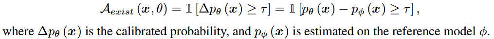
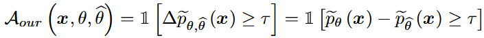
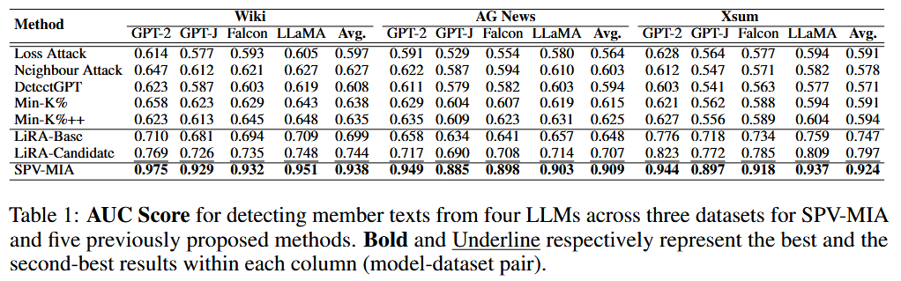
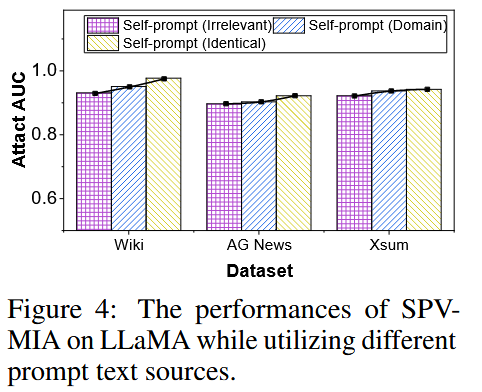
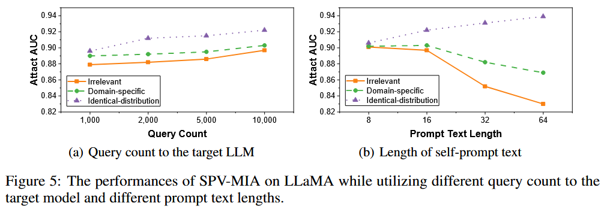
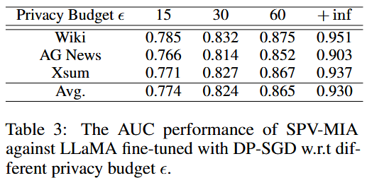

### (NeurIPS 2024) Membership Inference Attacks against Fine-tuned Large Language Models via Self-prompt Calibration

Motivation and contribution of this paper:

- Reference-based attacks that rely on overfitting can be mitigated by regularization methods and the generalization of LLMs. They are also too optimisitic about having access to a reference dataset from the same distribution as the training dataset.
- They therefore propose a MIA based on Self-calibrated Probabilistic Variation (SPV-MIA) and **constructs the dataset to fine-tune the reference model by prompting the target LLM itself.**
- They also propose probabilistic variation, a more reliable membership signal based on LLM memorization rather than overfitting, from which they rediscover the **neighbour attack** with theoretical grounding.


(Figure 1 (a): For LiRA, the attack performance will catastrophically plummet as the similarity between the reference dataset and the target dataset declines; 1 (b): existing MIAs cannot effectively cause privacy leaks when the LLM is not overfitting.)

Threat model: the attackers can access:

- Query API: The access to the query API that only provides generated texts and logits (or loss).
- Fine-tuning API: The access to the fine-tuning API of the pre-trained version of the target model.

A general version of referenced-based MIAs that adopt difficulty calibration:



and the model should be trained on a closely resembling dataset `D_mem`.

To circumvent the need for such a dataset, they propose:



The `\hat{\theta}` is the **self-prompt reference model**. 

1. Collect a set of text chunks with an equal length of `l` from a public dataset from the same domain
2. Utilize each text chunk as the prompt text and request the target LLM to generate text.
3. Only one reference model is used for computational efficiency, which can achieve sufficiently high attack performance.
4. **For Each Text They Want to Test for Membership**: 
   - Create 10 pairs of slight variations of this text using their paraphrasing system.
   - Feed the original text through the target model and see how confident it is. Feed all the variations through and see how confident it is with each. Look at how much the confidence drops when moving from the original to the variations. This tells you if there's a sharp "peak" of confidence around the original text
   - Repeat the exact same process with their reference model. If the target model shows much sharper drops in confidence when moving to variations (compared to the reference model), this suggests memorization. The idea is that a memorized text will have unusually high confidence that drops quickly with even small changes

> The authors use Section 4.3 (Probabilistic Variation Assessment (PVA) via Symmetrical Paraphrasing) to overview the motivation behind the proposed *probabilistic variation assessment* by demonstrating that memorization is a more reliable membership signal.
>
> - The overfitting is defined to start when PPL on validation starts to increase. But memorization actually starts earlier.
> - Overfitting is universally detrimental. But memorization is sometimes even crucial for generalization, and separately mitigates some unintended memorization is non-trivial.
>
> Memorization in generative models will cause member records to have a higher probability of being generated than neighbour records in the data distribution

Paraphrasing:

- For the embedding domain, embed the target text, then randomly sample noise following Gaussian distribution, and obtain a pair of symmetrical paraphrased texts by adding/subtracting noise.

- For the semantic domain, randomly mask out 20% tokens in each target text, then employ T5-base to predict the masked tokens.

- In experiments, they use semantic domain by default.

  ```
  peθ(x) ≈ 1/2N * Σ[pθ(xe+n) + pθ(xe-n) - pθ(x)]
  ```

Experiment setup:

- LLMs: GPT-2, GPT-J, Falcon-7B, LLaMa-7B
- Datasets: Wikitext-103, AG News, XSum




Figure 3: It verifies that our proposed self-prompt method can effectively leverage the creative generation capability of LLMs, approximate sampling high-quality text records indirectly from the distribution of the target training set.



Figure 4: self-prompt method demonstrates an incredibly lower dependence on the source of the prompt texts.



Figure 5: 

- The self-prompt reference model is minimally affected by the access frequency limitations of the target LLM.
- Self-prompt texts are very helpful even with very limited prompt length. From the identical dataset, attack performance increases with text length. From an irrelevant dataset, it decreases with longer texts.



Table 3: DP-SGD as a defense.

Table 4 (not shown): SPV-MIA can maintain a highlevel AUC across all PEFT techniques. Besides, the performance of MIA is positively correlated with the number of trainable parameters during the fine-tuning process. They hypothesize that this is because with more trainable parameters, LLMs retain more complete memory of the member records, making them more vulnerable to attacks.