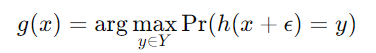
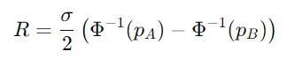
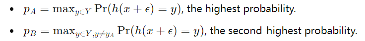
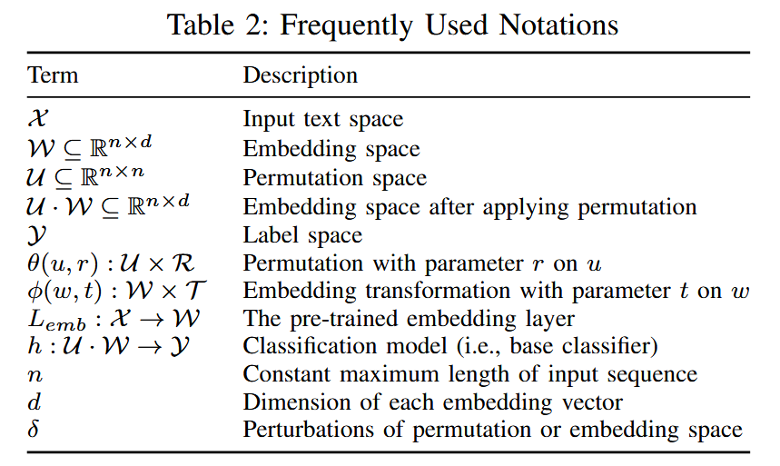

### (Oakland 2024) Text-CRS: A Generalized Certified Robustness Framework against Textual Adversarial Attacks

#### Introduction

Text classification models are vulnerable to word-level adversarial attacks, which imperceptibly manipulate the words in input text to alter the output. Previous defenses are only effective against specific adversarial attacks and can be broken by adaptive attacks.

Provable robustness: develop certifiably robust algorithms that ensure the model’s predictions are **stable over a certain range** of adversarial perturbations. Among different certified defense methods, **randomized smoothing** does not impose any restrictions on the model architecture and achieves acceptable accuracy for large-scale datasets.

Text-CRS: the first generalized certified robustness framework against common **word-level textual adversarial attacks** (i.e., synonym substitution, reordering, insertion, and deletion) via randomized smoothing. It provides *high universality* and *superior accuracy*.

Specifically, they model word-level adversarial attacks as combinations of permutations and embedding transformations. Then, the word-level adversarial attacks can be guaranteed to be certified robust if their corresponding permutation and embedding transformation are certified.

#### Preliminaries

Text classification involves three key components: data processing, embedding layer, and classification model. Given a text `x` labeled `y`, data processing first pads/drops it to a fixed length `n`, denoted `x={x_1, ..., x_n}`. Next, its embedded into a high-dimensional embedding vector `w={w_1, ..., w_n}`. The classification model `h` maps it to the label with loss `l(h(w), y)`.

In text classification, an adversarial text fools the text classification model, and is also semantically similar to the clean text for human imperceptibility. There are character-level, word-level, and sentence-level adversarial attacks. In this work, they focus on *word-level* ones, among which are mostly:

- Synonym Substitution
- Word Reordering
- Word Insertion
- Word Deletion

**Randomized Smoothing for Certified Defense**'s basic idea is to transform a base classifier into a smoothed classifier that predicts the label of a test example consistently:

- Given a testing example `x` with label `y`

- Define a (base) classifier `h` (any text classifier)

- Build a smoothed classifier `g` based on `h`, `x`, and a noise distribution (add the noise into `x`).  `g` will output the most likely label based on the `h`'s prediction over multiple noisy versions of `x`.

  

- Derive certified robustness for the smoothed classifier `g` in terms of **certified radius**: the maximum size of perturbations that can be introduced to the input data without changing the predicted class. 

- The radius depends on the probabilities of the most likely and second most likely classes output by the classifier.

  

  where

  and `Φ^{−1}` is the inverse cumulative distribution function (CDF) of the standard normal distribution.

#### Text-CRS Framework

Previous works (SAFER, CISS): guarantees against substitution operations.

Weaknesses of existing defenses and challenges:

- Measuring the perturbation and certified **radius**. We can't directly apply `l_1` and `l_2` distance because words are unstructured strings and don't have numerical relationship.
- Customized noise **distribution** for randomized smoothing against different word-level attacks. Uniform distribution is not ideal because synonyms may have different probability in the attack.
- Inaccurate representation of **distance**. The absolute distance between operation sequences is typically high for word reordering, insertion, and deletion operations.

So solve these challenges, they employ the numerical word embedding matrix as inputs rather than word sequence. Once we have this matrix, `l_` and `l_2` distances are applicable. They also introduce a permutation space to solve the high absolute distance problem design customized noise distribution for randomized smoothing.

