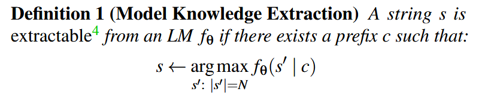
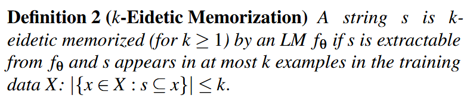
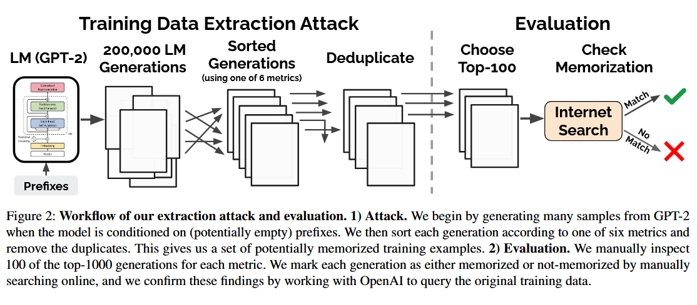
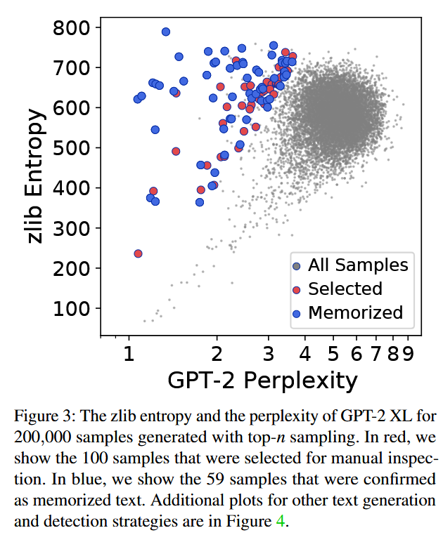
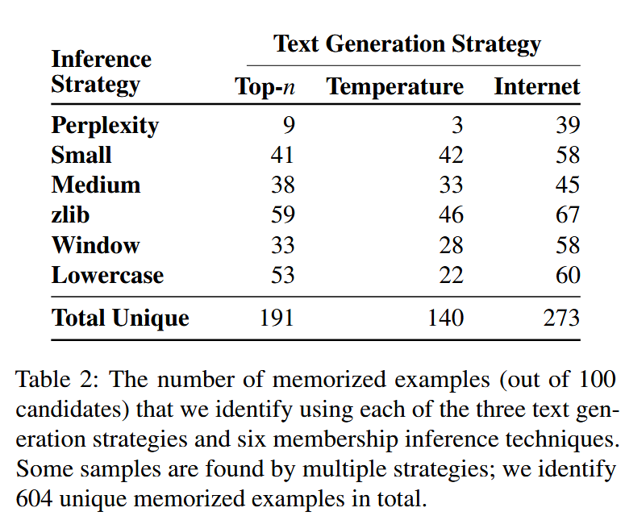
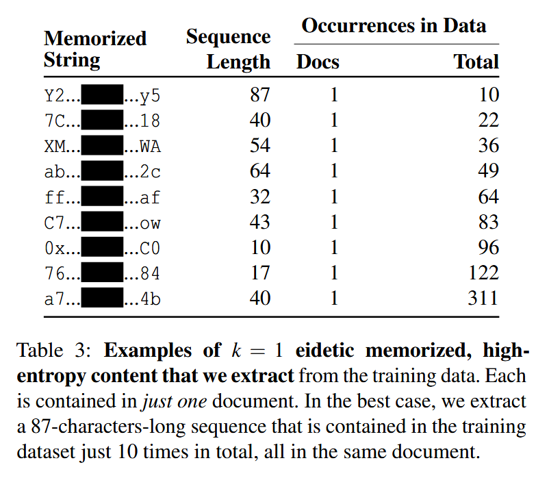
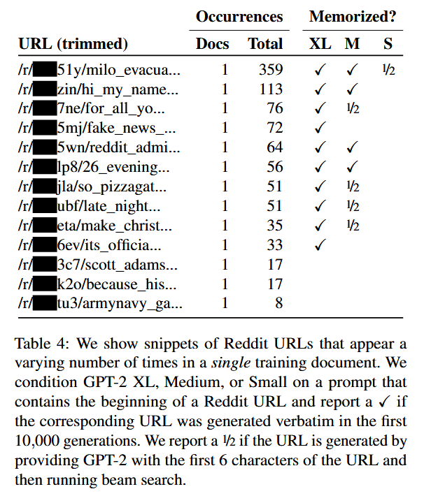

### (Usenix Security 2021) Extracting Training Data from Large Language Models

#### Background and Introduction

This paper discusses training **data extraction attack** to recover individual training examples by querying the language model, GPT-2. The attack is possible even though each of the above sequences are **included in just one document** in the training data.

By analysis, they worryingly find that larger models are more vulnerable than smaller models.

Privacy leaking as such is believed to be associated with *overfitting*, because overfitting often indicates that a model has **memorized** examples from its training set. Many believe that this is not the case in LLMs: these models are often trained on massive de-duplicated datasets *only for a single epoch*, they exhibit little to no overfitting.

The key insight of this paper is that, although training examples do not have noticeably lower losses than test examples on average, certain **worst-case training examples are indeed memorized**.

They first generate diverse set of *high-likelihood samples* from the model using three general-purpose sampling strategies, then sort each sample using one of six different metrics that estimate the likelihood of each sample using a separate reference model (e.g., another LM), and rank highest the samples with an abnormally high *likelihood ratio* between the two models.

They choose GPT-2 because its original training data source are already public to minimize real-world harm. In the best attack configuration, 67% of candidate samples are verbatim training examples, and extract an individual person’s name, email address, phone number, fax number, and physical address.

As for mitigation, **differentially-private training** is theoretically well-founded and guaranteed to produce private models if applied at an appropriate record level, but it can result in longer training times and typically degrades utility because **it causes models to fail to capture the long tails of the data distribution**.

The GPT-2 model family was trained on data scraped from the public Internet following outbound links from Reddit. Only document is retained and then de-duplicated at the document level. This resulted in a final dataset of 40GB of text data, over which the model was trained for approximately 12 epochs. As a result, GPT-2 does not overfit: the training loss is only roughly 10% smaller than the test loss across all model sizes.

Most part of this paper refers to *GPT-2* as GPT-2 XL, with 1.5 billion parameters. There are Small and Medium variants with 124 million and 334 million parameters, respectively.

#### Threat Model & Ethics

What it means for a model to have knowledge of a string s? a model `f_θ` knows a string s if s can be extracted by interacting with the model (in a black-box way, prompted by some prefix c).

Note that a string may appear multiple times on one page while still counting as k = 1 memorization. For a given k, memorizing longer strings is also “worse” than shorter strings. For example, under this definition, memorizing the correct spellings of one particular word is not severe if the word occurs in many *training examples* (i.e., k is large). Memorizing the zip code of a particular city might be eidetic memorization, depending on whether the city was mentioned in many training examples. 

The **strength of an attack** is measured by how private (formalized as being k-eidetic memorized) a particular example is.

A broader view of the privacy risks posed by data extraction stems from the framework of data privacy as **contextual integrity**: LMs may inadvertently emit data in inappropriate contexts, e.g., a dialogue system may emit a user’s phone number in response to another user’s query.

This study focuses on **k-eidetic memorization with a small k value** because it makes extraction attacks more impactful. Though it's termed attack, LMs will output memorized data even in the absence of an explicit adversary.

#### Improved Training Data Extraction Attack

A limited sampling: top-n (e.g. n=40) sampling and conditioned the LM on the start-of-sequence token as input. They hope that this will sample sequences that the model considers “highly likely.” This strategy will only generate sequences that are likely from beginning to end. As a result, top-n sampling will cause it to generate the same (or similar) examples several times.

By adding **temperature**, models are less confident and the output may be more diverse.

Next token is based on:
$$
Pr(x_i | x_1, ... x_{i-1})
$$
Then,
$$
z = f_\theta(x_1,...,x_{i-1})\\
y= softmax(z)\\
softmax(z)_i =\frac{exp(z_i/t)}{\sum^n_{j=1} exp(z_j/t)}
$$
After the sampling process begins to emit a memorized example, we should avoid it to randomly step off the path of the memorized output. Therefore, the temperature decays over time of the first 20 tokens (≈10% of the length of the sequence) from `10` to `1`.

At last, they sample by **conditioning on Internet text**. The model can generate samples with a diverse set of prefixes that are similar in nature to the type of data it was trained on.

#### Improved Membership Inference

Filtering out samples with low likelihood has poor precision due to failures in the underlying language model. They can have spuriously high likelihood:

- Trivial memorization like numbers from 1 to 100.
- Repeated substring like "I love you."

They choose to **compare to a second LM**. Given a second model that accurately captures text likelihood, we should expect it will also assign high likelihood to these forms of memorized content. And we inspect those where the original model’s likelihood is “unexpectedly high” compared to a second model.

Four strategies:

- Compare to other NLP models.
- Compare to zlib compression. Compute the zlib entropy of the text: the number of bits of entropy when the sequence is compressed with zlib compression. Then use the ratio of the GPT-2 perplexity and the zlib entropy as our membership inference metric.
- Comparing to lowercased text (same model). Measure the ratio of the perplexity on the sample before and after lowercasing it.
- Perplexity on a Sliding Window. Sometimes a model is not confident when the sample contains one memorized substring surrounded by a block of non-memorized (and high perplexity) text. To handle this, they use the minimum perplexity when averaged over a sliding window of 50 tokens.

#### Evaluation

In total across all strategies, they identify 604 unique memorized training examples from among the 1,800 *possible candidates* (not all generated text), for an aggregate true positive rate of 33.5% (the best variant has a true positive rate of 67%). Note that this is likely an extremely loose lower bound. They only manually inspected 1,800 potential candidate memorized samples.

Most memorized content is fairly canonical text from news headlines, log files, entries from forums or wikis, or religious text. Some are UUIDs, valid URLs, contact information.

Sampling conditioned on Internet text is the most effective way to identify memorized content.

The comparison-based metrics are significantly more effective at predicting if content was memorized.

Top left: GPT-2 assigns a low perplexity (a high likelihood) but zlib is surprised by. These points are more likely to be memorized than those close to the diagonal.

#### Mitigation

- Training With Differential Privacy. It is unclear how to apply DP in a principled and effective way on Web data.
- Curating the Training Data. E.g. by identifying and filtering personal information or content with restrictive terms of use. It is also important to carefully de-duplicate the data, but the granularity and strategy is an open question. It serves as a first line of defense and not an outright prevention against privacy leaks.
- Limiting Impact of Memorization on Downstream Applications. On the positive side, this finetuning process may cause the LM to “forget” some of the data that is memorized during the pre-training stage, though it can introduce its own privacy leakage. An interesting direction for future work is to explore how memorization is inherited by fine-tuned models.
- Auditing ML Models for Memorization.

Lessons learned:

- Extraction Attacks Are a Practical Threat.
- Memorization Does Not Require Overfitting. LLMs have no significant train-test gap and yet we are still able to extract numerous examples verbatim from the training set.
- Larger Models Memorize More Data.
- Memorization Can Be Hard to Discover. Much of the training data that are extract is only discovered when prompting the LM with a particular prefix. Better prefix selection strategies might identify more memorized data.
- Adopt and Develop Mitigation Strategies.