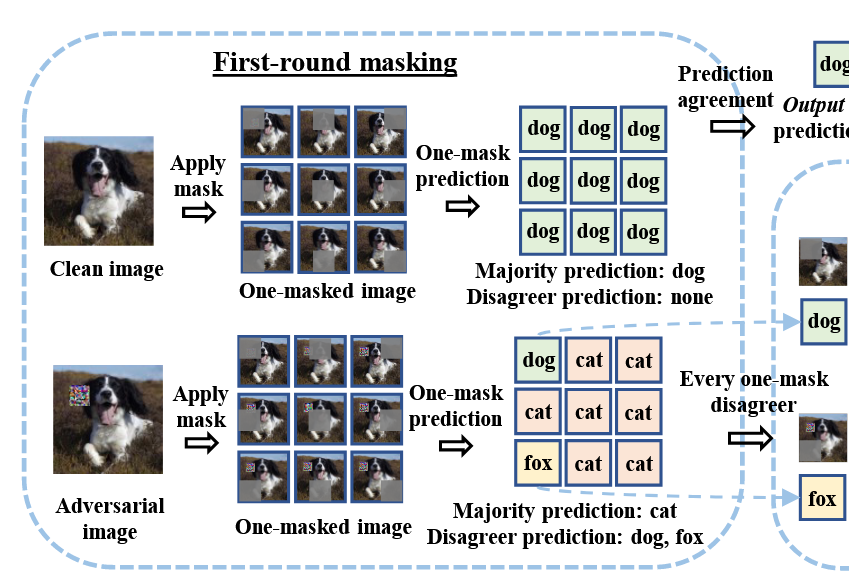
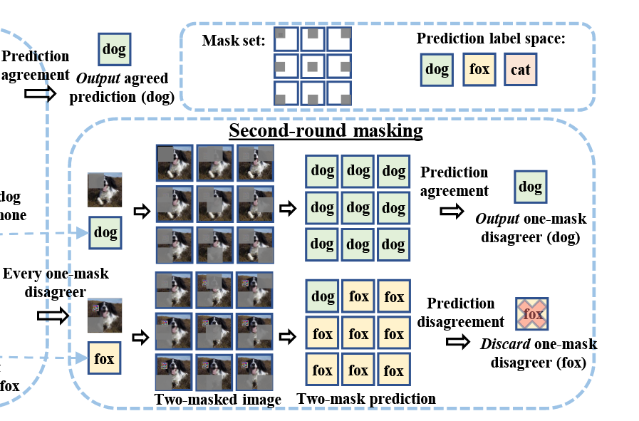
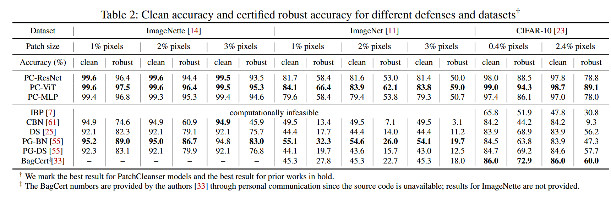
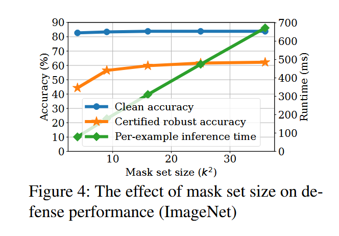
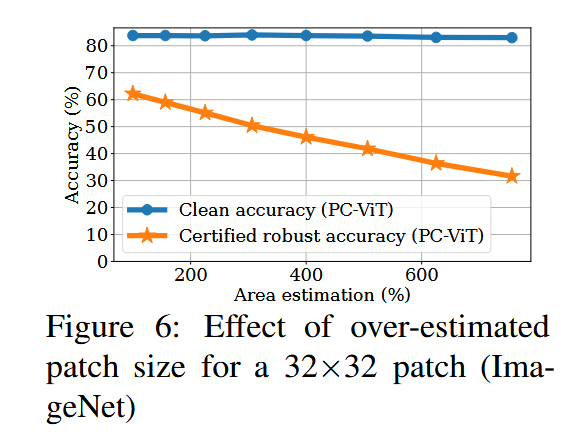
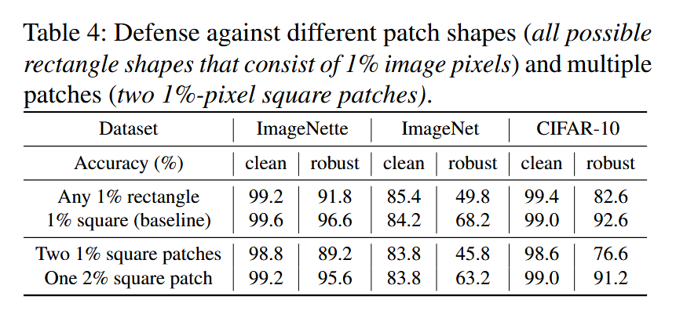

## (Usenix Security 2022) PatchCleanser: Certifiably Robust Defense against Adversarial Patches for Any Image Classifier

Previous works:

- Depend on small receptive fields and incur significant accuracy loss when applied.
- Minority reports (MR) detects the attack, but only abstains from prediction and requires human intervention.

PatchCleanser:

- Robustly remove/mask all adversarial pixels on the input image.
  - If the mask is large enough, then at least one masked image is benign.
- Challenge: robustly distinguish this benign prediction from other masked predictions that can be adversarial.

- Clean image: all one-mask predictions typically agree on the correct label (“dog"), the defense outputs the agreed prediction

- Adversarial image: one-mask predictions have a disagreement
- The mask is designed so that at least one can remove the entire patch

For every mask that leads to a disagreer prediction, they add a set of second masks and evaluate two-mask predictions.

- If they all agree, output
- If no, discard it
- If no one-mask disagreer prediction passes the second-round agreement test, then the algorithm falls back to the majority prediction from the first round.
- The algorithm processes disagreer predictions sequentially. As soon as it finds a disagreer prediction that passes the second-round agreement test, it immediately returns that prediction without checking other disagreers.
- When two masks are applied simultaneously, they remove substantial information from the image. For challenging classification tasks, this can make some images inherently impossible to classify correctly regardless of the defense. This causes the accuracy drop from clean one to the defended one.

Mask set:

- The mask size (m) needs to be large enough to cover the patch
- The stride (s) determines how masks overlap
- Patch size must satisfy: `p* <= m - s + 1`

- For a given computation budget k (number of masks) and estimated patch size p̄:
  - Calculate the stride: `s = ⌈(n - p̄ + 1)/k⌉`
  - Calculate the mask size: `m = p̄ + s - 1`
- If we want to improve the efficiency (by having a smaller k), we will have to use a larger stride s and larger mask size m. Intuitively, the model prediction is less accurate for a larger mask.
- They show that certified robust accuracy is the lower bound of model accuracy against any adaptive attacker within the threat model.
  - The certification considers all possible patch placements and contents that an attacker might use

### Setup

- It works for all model architectures
- They focus on test-time *untargeted* evasion attacks
- They assume that the adversary can control a *square* region that can be anywhere on the image, and the defender has a conservative estimation of the patch size
  - They show that it can be adapted to attacks with a set of different patch shapes or even multiple patches
- They only discuss certification for *labeled* images, and do *not* aim to guarantee robustness/correctness for individual images in the wild.
- One ***disadvantage*** of this pipeline, I think, is that the inference overhead is too high (at least 9x).

### Evaluation

In default setup, they set the number of masks `k_0 × k_1 = k^2 = 6 × 6`.

The clean accuracy with defense is very close to the state-of-the-art undefended models (the difference is smaller than 1%). It also demonstrates SOTA robust accuracy.

The certified robust accuracy drops when we over-estimate the patch size too much.

- Note: an underestimated patch size/shape will undermine the robustness.
- The requirement for a good estimate is a *limitation* of this method.

Why? `m = p̄ + s - 1`, where s is the stride. To maintain the same number of masks with larger mask sizes, the algorithm must increase the stride s between masks. Larger strides mean less overlap between masks, which reduces the defense's ability to precisely localize and neutralize the actual (smaller) adversarial patch.

And their defense is robust against different rectangular shapes and multiple patches:

Another limitation they mention:

> **Handling potential semantic changes caused by masks.** PatchCleanser uses masks to achieve substantial robustness against adversarial patches, and we have demonstrated its effectiveness on common image datasets. However, the masking operation might lead to semantic changes for special classification tasks (e.g., a classifier trained to recognize masks). In these special cases, we could use colored masks for PatchCleanser and further train the classifier to distinguish between vanilla masks and PatchCleanser masks. We leave further explorations for future work.