### (Usenix Security 2022) Teacher Model Fingerprinting Attacks Against Transfer Learning

#### Motivation

This paper investigates the teacher model exposure threat in the transfer learning context, aiming to gain a deeper insight into the **tension between public knowledge and model confidentiality.** They propose a **teacher model fingerprinting attack** to infer the origin of a student model. The empirical results demonstrate that our attack can accurately identify the model origin with *few probing queries*.

Concerns in transfer learning:

- Choosing an appropriate teacher model requires a large number of engineering efforts. So the choice of a teacher model belongs to the model owner’s intellectual property (IP).
- On the other size, a teacher model owner does not want their model to be transferred to perform unethical or illegal tasks. So it needs a way to track the parties that use their model to build student models.
- Malicious parties can intentionally publish vulnerable ML models online. When such models are used as teacher models for transfer learning, the corresponding student models may inherit some vulnerabilities.
- Also, after learning the teacher model that a student is transferred from, an attacker can perform more effective malicious attacks (adversarial examples, membership inference). Recent study also shows that transfer learning may transfer vulnerabilities from the teacher.

The attack proposed in this work achieves high **teacher model inference accuracy** even with a limited number of queries in **top-1 label** exposure. It works well with synthesized queries from samples unrelated to the target domain or even random noises. By quickly **identifying pre-trained components**, the attackers are closer to launch model stealing attacks.

For transfer learning, there are two strategies:

- **Feature extractor**: where **all** pre-trained layers are frozen to compose a feature extractor
- **Fine-tuning**: where part of the pre-trained parameters will be updated to fit better on the fine-tuning dataset

In this paper, they design a method to infer the origin of a student model with only **black-box access**. The motivation is that *student model is likely to inherit fingerprintable model behaviors* i.e. the way to extract features in our case (*feature map*).

#### Threat Model

The attacker has a black-box access to the victim student model `S`. He can send input `x` to it via an API `f()` and receives `f(S(x))`.

- `f(S(x))=S(x)`. The response includes the exact model output, including class labels and confidence values.
- `f(S(x))=S(x)+ε`. This is a defense method to avoid attacks like membership inference. The perturbation shouldn't change the top-1 predicted label.
- `f(S(x)) = argmax_i (S(x)_i)`. Only the top-1 label is returned.

The work will show that attack is possible for the **third case** - the most restricted one.

The attacker will have a list of **candidates** that are potential teacher models from public resources. No datasets for either teacher or the student is available, but the attacker can make use of *public ones*.

The attacker has two primary goals: one is to **infer** the teacher model accurately, while the other is to use as few probing queries as possible, to **limit attack costs and keep the attack stealthy**.

#### Teacher Model Fingerprinting

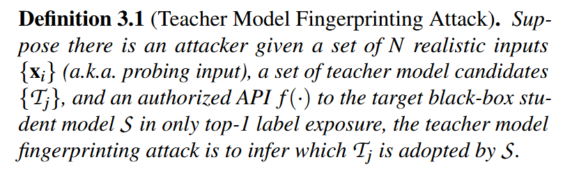

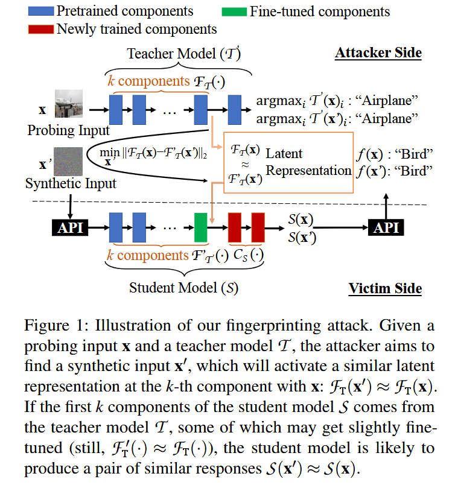

The first step is to construct the synthetic inputs to trigger similar latent representation with the original specific input (in the deep layers). This process doesn't involve querying the original model.

After obtaining these fingerprinting pairs, send these to the target black box. Ideally, if the target model relies on the feature extractor from the teacher model, most generated fingerprinting pairs would produce a pair of responses matched on the same label.

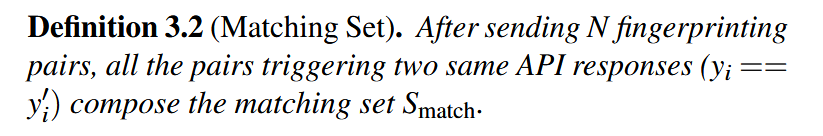

Formally,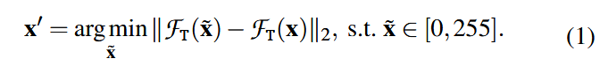

Let: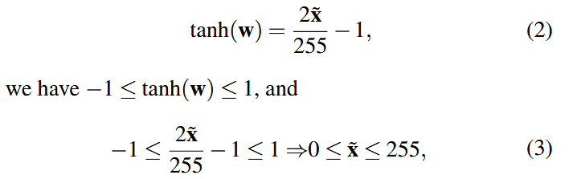

Convert equation (1) by replacing x with w: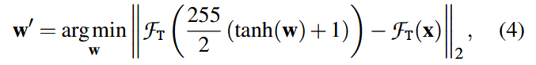

They use Adam gradient descent to solve it. After convergence, check if the constructed sample still shares the same label. If not, discard it.

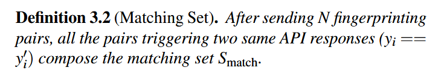

The more matched pairs of black-box responses are obtained, the more likely the target model is transferred from that particular model.

There are several heuristics to determine the result:

- Matching proportion: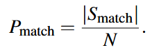For each victim model, there's an array composed of this metric for each candidate feature extractor. The highest `P_match` may correspond to the teacher unless it's under certain threashold.
- Eccentricity: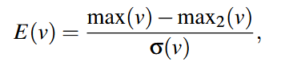where max(·) and max2(·) refers to the first and second highest value, respectively, and σ(·) refers to the standard deviation. The higher the eccentricity, the more confident the attacker is to make the inference.
- Empirical entropy: measure how much information the matching set  represents. `X` is a set of matching responses. Higher entropy indicates lots of variance in the attack set and the responses are more informative.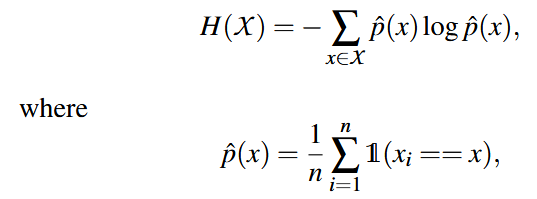

#### Evaluation

Dataset:

- Dogs-vs-Cats
- MNIST
- CIFAT10 and CIFAR100
- STL10
- CelebA (facial images)
- VOC-Segmentation: assume the image annotation information (i.e., segmentation and class information) is unavailable.
- Random Noise: simulates the case that the attacker cannot acquire any realistic image to build up the attack dataset. In this scenario, they have to synthesize images with randomly generated pixels to compose the attack dataset.

Teacher models:

- AlexNet, DenseNet121, MobileNetV2, ResNet18, VGG16, VGG19, and GoogLeNet from the repository of PyTorch.
- They adopt the whole convolution part of each pre-trained model as the feature extractor in the experiments.
- The attacker constructs 100 fingerprinting pairs for each teacher feature extractor.

Student models:

- Feature extractor approach for transfer learning.
- Assume the attacker knows how many layers of the teacher model will be used in the transfer learning.

Results:

- For all the 126 victim student models transferred from the seven teacher model candidates, the teacher model candidates with the highest P_{match} are consistent with the ground truths (i.e., 100% inference accuracy).
- In general, the more classes that the transfer learning task involves, the stronger evidence the attacker can receive to infer the teacher model.
- The student dataset possibly affects the attack performance. In fact, the attack performance is subject to the similarity between the student dataset and the probing dataset.

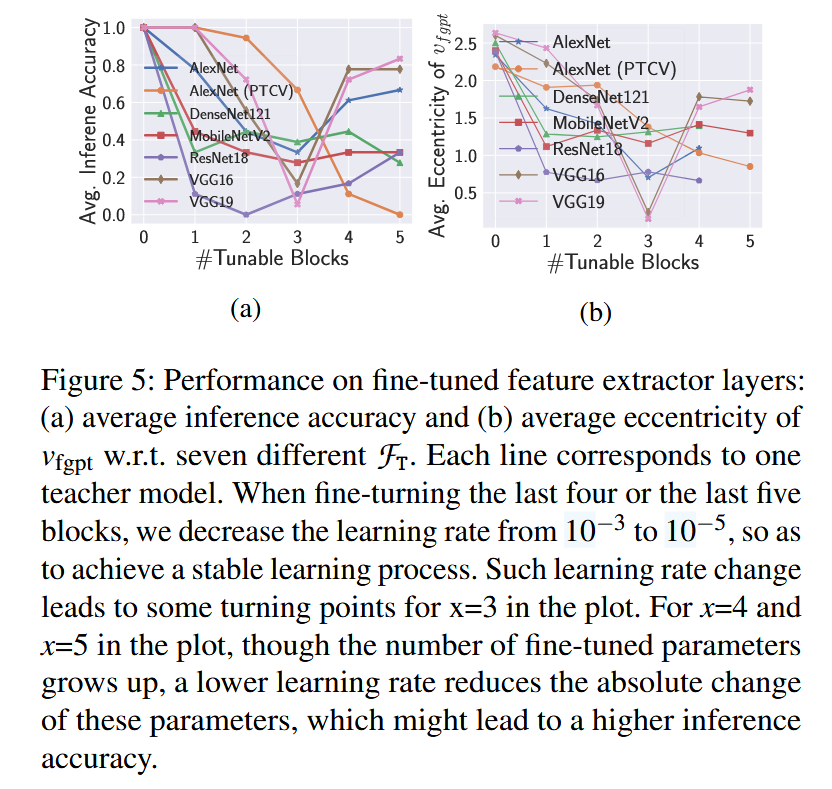

In general, the inference accuracy is likely to decrease when more parameters get fine-tuned.

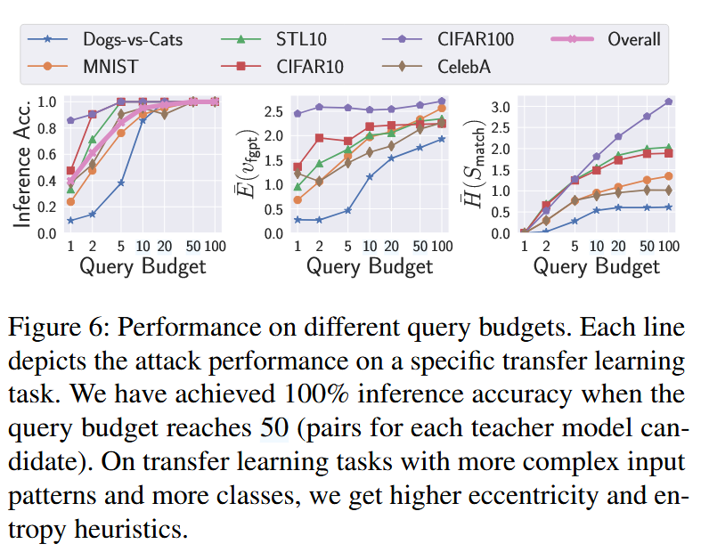The attack against a more complex transfer learning task is likely to bring higher “inference belief.” For instance, the attack on CIFAR100 classifiers shows relatively high average eccentricity and entropy.

Ss the query budget increases, the average eccentricity and the average entropy also rise.

#### Robustness Enhancement

False matching: for MNIST classification student models, we get P_{match} = 0.86 with an AlexNet candidate against a VGG19-based student model.

Try to remove some samples with the maximum occurrence from S_{match} (The matching set, Definition 3.2).

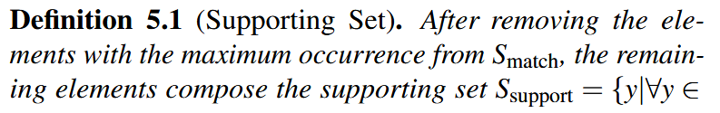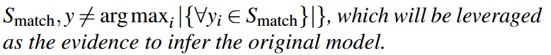

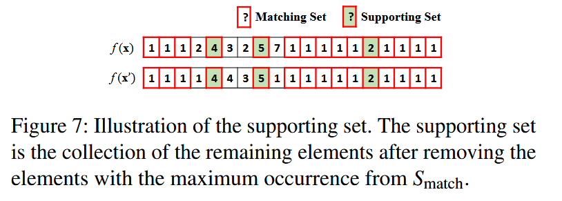

This enhances the robustness of the attack a lot.

#### Applications of the Fingerprinting Attack

**Model Stealing**

Though I cannot clearly see the point of this messy figure, the author argues that an extracted model transferred from the same teacher model with the target (i.e., inferred by a successful teacher model fingerprinting attack; marked with thicker lines), it has finally achieved higher accuracy and fidelity with sufficient queries.

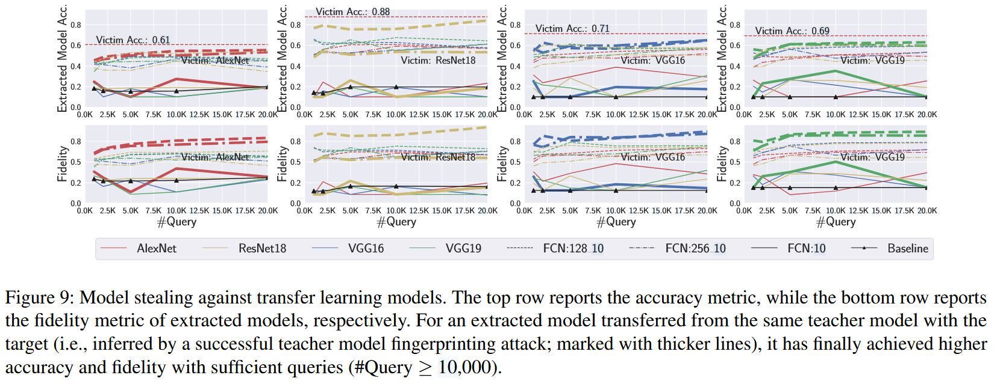

**Identifying Vulnerable Teacher Models**

The purpose of this section (6.2) is to evaluate how the proposed fingerprinting attack can be used to determine whether a student model originates from a known vulnerable teacher model, such as those infected with latent backdoors.

The results showed that the inference accuracy for identifying backdoored and clean teacher models was 19/27 and 15/27, respectively. It was more challenging to distinguish clean teacher models from backdoored ones since the latter were fine-tuned versions of the former. However, the experiment confirmed the attack's feasibility in identifying vulnerable teacher models.

#### Defenses

These two are effective to evade the attack proposed in this paper.

- Input distortion. One potential solution is to distort inputs by inserting small random noise or performing image transformations like image cropping and resizing. Hopefully, it would only slightly affect model performance on realistic inputs but significantly reduce the inference attack accuracy, since the latent feature is sensitive to the optimized “noise” pattern in a synthetic input.
- Injecting neuron distances. Retrain all student layers on the student dataset, with the optimization goal to minimize the cross-entropy loss while ensuring the dissimilarity between the student’s and the teacher’s intermediate representations is above a threshold.

#### Future Works

- Extend the evaluations to language models.
- Advanced adversarial attacks. Use this attack to assist others e.g. adversarial examples or membership inference.
- Fingerprint erase. 