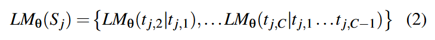
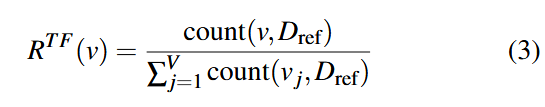
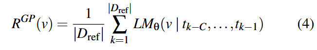
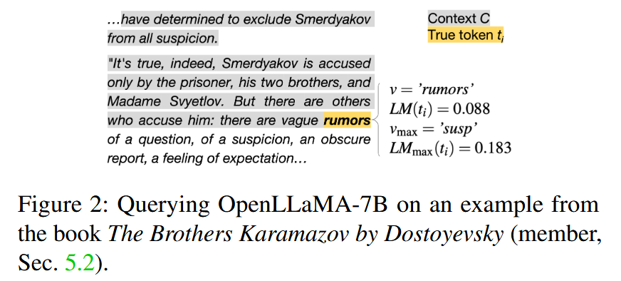
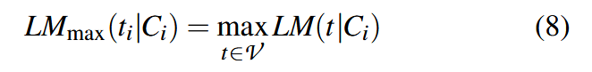
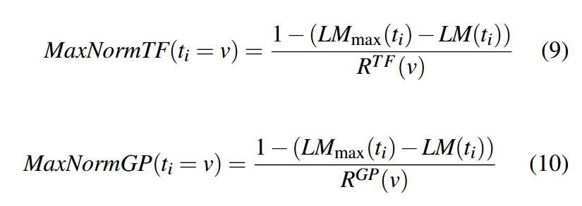
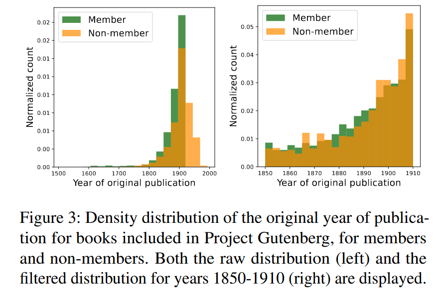
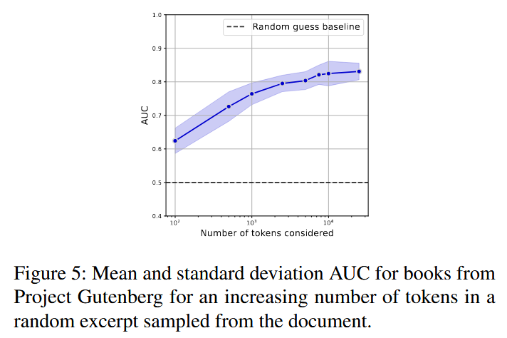

### (Usenix Security 2024) Did the Neurons Read your Book?  Document-level Membership Inference for Large Language Models

#### Introduction

Contribution of this paper:

1. Formalize the task of <u>document-level membership inference</u> and propose a procedure and dataset for the development and the evaluation
   - The development of a <u>meta-classifier</u>, requires a dataset with members and non-members.
2. Introduce a <u>black-box methodology</u>. Their auditor can distinguish the contribution of an individual document by:
   1. Querying the model for token-level predictions
   2. Normalizing the predictions for how common the token is
   3. Aggregating the predictions to the document level
   4. Building a meta-classifier
3. Show that previous SOTA sequence-level baselines, when scaled to document-level, to perform poorly in this setup.
4. Investigate whether smaller models would impact the ability of an auditor to infer document membership. They find that the inference still works.
5. Consider several mitigations. In particular, they find that the AUC slowly decreases for partial documents.

Setup:

- The auditor would like to know whether a document `D` is included in the training set `D_{train}`. They further assume the length of the document <u>exceeds the context length</u> of the LM.
- The auditor only has <u>black-box</u> access to the LM (can receive the probability output for all tokens `v` in vocabulary `V`) and full access to its tokenizer `T`. They can also query the LM for <u>arbitrary number of times</u>.
- The auditor has access to two sets of documents of the same distribution `D`  (say, books), which the author believes is realistic:
  - `D_M`: used in the training of LM (members)
  - `D_{NM}`: non-members, could be collected from common sources (e.g. Commn Crawl, Project Gutenberg), with data released after the model is trained
- They assume that the training data is seen by the LM for exactly one time in its <u>entirety</u>.
- They assume that the LM is a foundation model trained only on next-token prediction, not subject to instruction tuning, RLHF, watermarking etc.

#### Method

- Query the LM and retrieve the predicted probability of every token in document `D`, given the context of length `C` (tokens right before it). `C` is a hyperparameter of this process that can be any integer smaller than the context window of the LM.

  - The document is split in `N_s` sequences `S_j` (consists of `C` consecutive tokens, last sequence possibly <= `C` tokens)

  - Each sequence `S_j` is passed into LM by querying `C-1` times:

    

  - We move through the document with stride `s=C-1`, therefore, `N_s=[N/(C-1)]` where `[]` denotes rounding up. The resulting set `LM(t_i)` will contain every token but the first one. 

- Normalize the predicted probability of a token.

  - The probability with which a model predicts a certain token would depend on how rare such a token is. Tokens like `the` `end` will inherently be more frequently predicted. However, we want information that can decide whether the document appears during the training.

  - To address this, previous works consider zlib entropy or a reference model as a <u>normalization</u>, which, however, doesn't take into account per-token information.

  - The authors define `D_{ref}` as the union of `D_M` and `D_{NM}` as mentioned above. 

  - The token frequency of a token is defined as:

    

    As will be seen, though simple, it <u>works better than `R^{GP}`</u>.

  - The general probability of a token `v` is defined as:

    

    which quantifies the average predicted probability for each token across *all contexts* in the reference dataset

  - Naively, we can directly use this `R^{GP}` or the token frequency (`R^{TF}`) in `D_{ref}` to normalize the `LM(t_i)`. However, they also propose to consider the difference between the maximum predicted probability across all tokens and the probability of the true token.

    

    

    

    The key insight for MaxNorm is to consider not just how likely the model thinks the true token is, but how that probability compares to what the model thinks is the most likely token in that context. A smaller difference suggests the model is <u>more confident</u> about the true token, which could indicate it has seen this text during training. As in Section 6, <u>MaxNormTF</u> works the best.

- Aggregate all token level information for a document `D` to construct document level features.

  - `F(t_i) = -log(NORMALIZE(LM(t_i)))`. Note that if no normalization is used, this is equivalent to cross-entropy loss.
  - We use the per-token feature `F(t_i)` to construct document-level feature. This could be either:
    - Aggregate feature extractor: compute the min, max, mean, std, and x-percentiles of all `F(t_i)`.
    - Histogram feature extractor: 
      - Creates `N_b` equal-sized bins based on all token-level values in the training dataset. For each document, computes the fraction of its `F(t_i)` values that fall into each bin.
      - Results in `N_b` features per document representing the distribution of token-level values
      - This methods are proved more effective than `AggFE`.

- Meta-classifier `M` makes a binary prediction on the features.

  - They only consider random forest.

#### Evaluation

Two Types of Documents:

1. Books from Project Gutenberg
2. Academic papers from ArXiv

For <u>Books</u>, for example:

Members (`D_M`):

- Used PG-19 dataset containing 28,752 English books published before 1919
- Part of RedPajama-Data used to train OpenLLaMA

Non-members (`D_{NM}`):

- Downloaded books added to Project Gutenberg after February 10, 2019 (the latest release date in PG-19). Got 9,542 books
- To control for language drift/style differences, they only used books published between 1850-1910 (shown in Figure 3)

For ArXiv papers, they use a preprocessing technique for all papers:

- Removing bibliography
- Removing comments
- Removing everything before the first section
- Using the raw LaTeX text

#### Results

Overall Performance (6.1)

- Best AUC: 0.856 for books and 0.678 for papers
- Significant given the small contribution of individual documents to training data (books ~4.5%, papers ~2.5%)
- Key findings on different components:
  - Context length (C) had little impact on performance
  - Normalization was crucial - all strategies outperformed NoNorm
  - HistFE significantly outperformed AggFE (suggesting membership signals lie in detailed distribution patterns)
  - Best setup: C=128, MaxNormTF normalization, HistFE aggregation

Comparison to Sequence-level Baselines (6.2):

- Tested existing sequence-level membership inference methods
- All baselines performed poorly (max AUC ~0.56-0.57)
- Suggests sequence-level approaches don't scale well to document-level inference

Model Size Impact (6.3):

- Tested on OpenLLaMA 3B, 7B, and 13B models. Performance remained consistent across model sizes
- Contrasts with prior work showing memorization increases with model size. Authors note this might be because they're looking at different aspects of memorization
  - They measure memorization by evaluating document-level inference
  - Very different than the extraction of specific sensitive information.

Mitigation Strategies (6.4):

Partial Documents:

- Even 100 tokens achieved AUC of 0.62
- Performance increased with more tokens up to 0.83 for 25,000 tokens

Model Quantization:

- Lower precision (int4, int8) had minimal impact on performance
- Suggests membership signals persist even with reduced model precision

Performance Difference Between Datasets (6.5): Books performed better than papers (0.856 vs 0.678) for three possible reasons:

a. Data Differences:

- Papers contain specific LaTeX formatting
- Books have more diverse natural language tokens

b. Length Differences:

- Books average ~112,000 tokens

- Papers average ~19,000 tokens

- Longer documents provide more signals for membership inference

  

c. Data Duplication:

- Popular books likely appear multiple times in training data through web scraping
- Academic papers (especially in LaTeX) rarely distributed widely
- The authors note that when a document appears multiple times in training data, it likely strengthens the membership signal, which could explain the better performance on books.

#### Discussion

Future Research Directions:

- Testing the method when full knowledge of training data isn't available
- Applying to commercial models like LLaMA and LLaMA-2
- Potential for combining signals from multiple model sizes in the same family
- Impact of alignment methods and watermarking on membership inference
- Effects of larger datasets on meta-classifier performance

