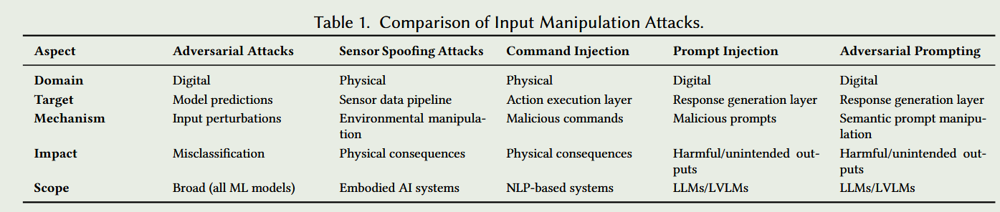
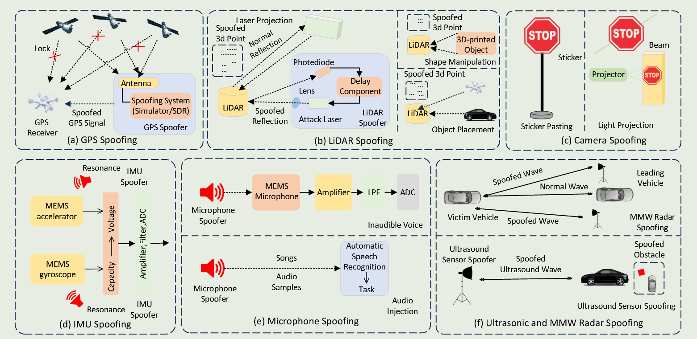

## (ArXiv 2502) Towards Robust and Secure Embodied AI: A Survey on Vulnerabilities and Attacks

Embodied AI has a wide array of application scenarios, but also expose many attack vectors regarding sensor spoofing, adversarial attacks, and failures in task and motion planning.

In this paper, they categorize these vulnerabilities into:

1. Exogenous vulnerability.
2. Endogenous vulnerability.
3. Inter-dimensional vulnerability.

### Categories

#### Exogenous Vulnerability

1. Dynamic Environment Factors
   1. Environment changes
   2. Adversarial perturbations
2. Physical Attacks
   1. Hardware tampering (especially for CPS)
3. Adversarial Attacks
4. Cybersecurity Threats
   1. Like Mirai botnet, Drone Hijacking through GPS spoofing
5. Human Interaction and Safety Protocol Failures

#### Endogenous Vulnerability

1. Sensor and Input Validation Failures
2. Hardware and Mechanical Failures
3. Software Vulnerabilities and Design Flaws

#### Inter-Dimensional Vulnerability

For example, a cyber attack (exogenous) that exploits a software vulnerability (endogenous) could  lead to unauthorized control of a robot or vehicle. Environmental factors such as extreme temperatures or humidity could accelerate hardware degradation, leading to  mechanical failures.

1. Instruction Misinterpretation (Talk2car, ALFRED)
2. Ethical and Safety Implications of Interactive Agents (Embodied Question Answering -> Misinformation)
3. Lack of Robustness in Unseen Environments

### Attack to Vulnerabilities

#### Vulnerability Analysis

1. Training data limitations (toxic, biased)
2. Adversarial Vulnerabilities
3. Expanded Attack Surface: from single modality to *LVLMs* (e.g. used in autonomous driving)
4. Transitions from Text to Actions
   1. Jailbreaks in LLMs don't fully apply.
   2. For example, embodied LLMs often generate structured outputs, such as JSON or YAML, which are then used by downstream control modules to execute actions. Attackers  could exploit these structured outputs to manipulate the system’s behavior, leading to unsafe or unintended actions.

#### Attack targets

- Perception Systems: on cameras, LiDAR, GPS, such as Drone GPS Spoofing Attack.
- Control Systems: for example, an attacker could  manipulate a robot’s control system to cause it to collide with objects or humans.
- Communication Channels: wireless communication. For example, jamming or Man-in-the-Middle Attacks (MitM).

#### Attack Taxonomy

- Exogenous Vulnerability Centric Attacks
  1. Data-Centric Attacks (Poisoning)

  2. Input Manipulation Attacks

     1. Adversarial Attacks
     2. Sensor Spoofing
     3. Command Injection
     4. Jailbreak
     5. Adversarial Prompting

     

  3. System and Infrastructure Attacks

     1. API Manipulation
     2. Denial-of-Service (DoS)
     3. Man-in-the-Middle (MitM) Attacks: use strong encryption (IPsec, TLS) and intrusion detection systems (IDS)

- Endogenous Vulnerability Centric Attacks

  1. Model-Centric Attacks (Model Extraction)
  2. System and Infrastructure Attacks (Supply Chain Attacks, e.g. SolarWinds)
  3. Sensor and Hardware Attacks (Side-Channels, Firmware Attacks)

- Inter-Dimensional Vulnerability Centric Attacks (Sophisticated and Coordinated Attacks)

  1. Advanced Persistent Threats (APTs): long-term, stealthy attacks, gradually compromising the system over time without being detected.
  2. Ransomware Attacks: rendering embodied AI systems inoperable until a ransom is paid. Embodied AI systems are particularly vulnerable due to their reliance on real-time data processing, where ransomware-induced failures can cascade across interconnected systems.

#### Case Study: Sensor Spoofing

This section focuses on how attackers can manipulate sensors in embodied AI systems to bypass security measures and compromise system integrity. The section categorizes attacks on six main sensor types:

1. **Tactile Sensors**: Vulnerable to physical damage, force/pressure manipulation, and cross-talk in capacitive sensors.
2. **Vision Sensors**: Susceptible to adversarial patches, light projection attacks, and exploiting invisible light spectrum portions to cause misclassifications or navigation errors.
3. **Proximity Sensors**: Attacks include laser projection, shape manipulation, and environmental interference targeting LiDAR, ultrasonic, MMW (Millimeter-Wave) radar, and infrared sensors.
4. **IMU (Inertial Measurement Units)**: Data on orientation, velocity, and acceleration through a combination  of accelerometers, gyroscopes, and magnetometers. Vulnerable to resonant acoustic interference that manipulates the sensor's mass-spring structure, leading to inaccurate readings.
5. **GPS**: Attacked through signal disruption and location manipulation using GPS simulators or Software Defined Radios (SDRs).
6. **Auditory Sensors**: Compromised through inaudible voice attacks and audio injection to trigger unauthorized actions.

The remaining LLM-related contents are omitted.