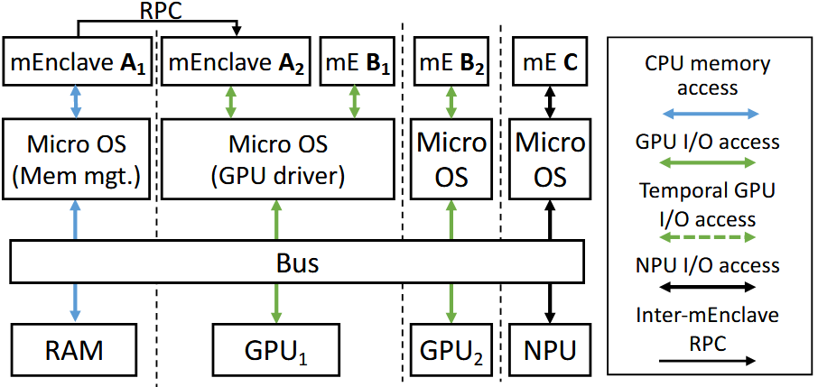
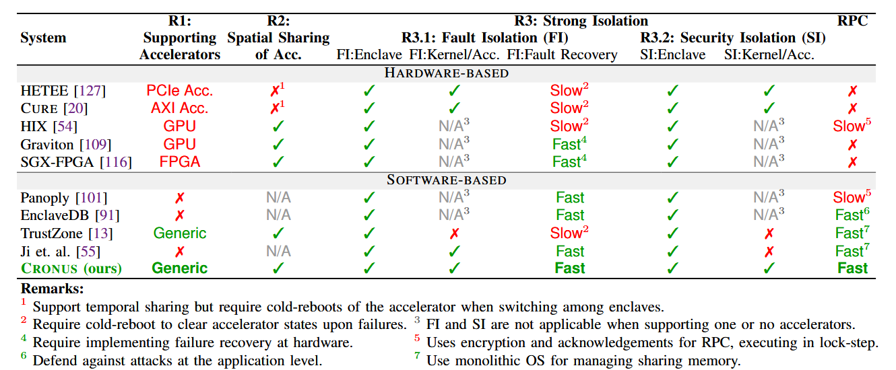
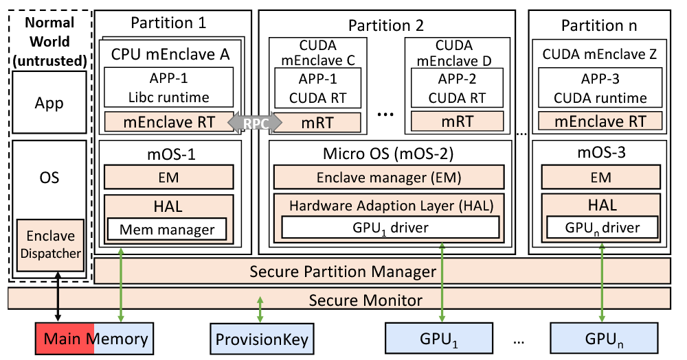
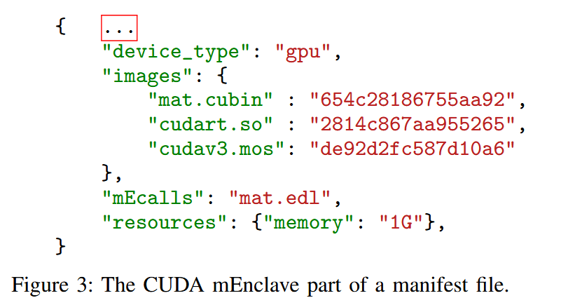
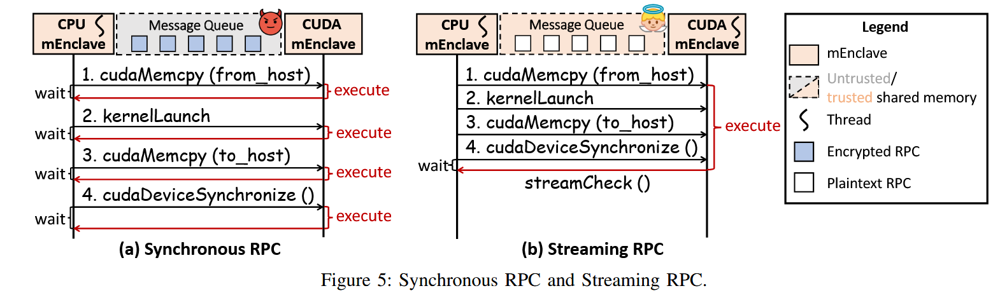
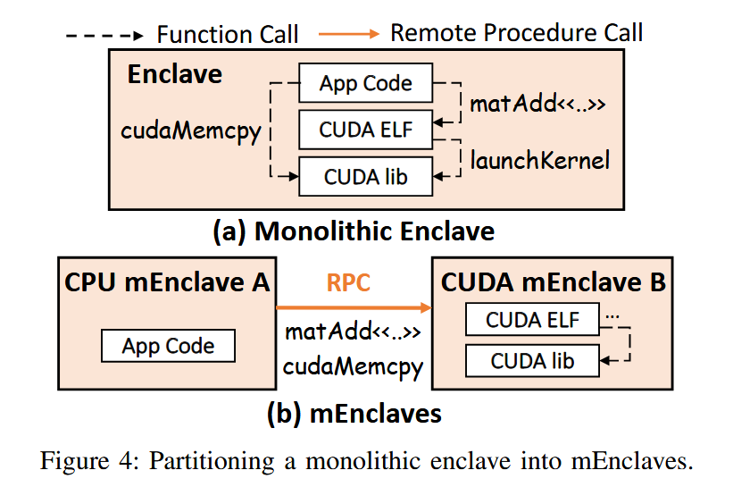
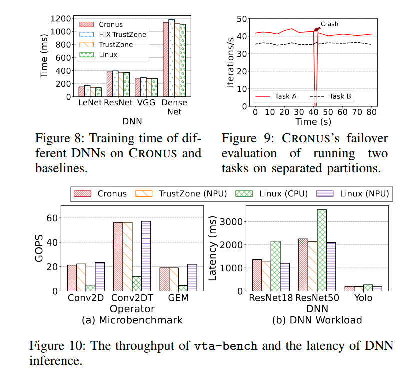
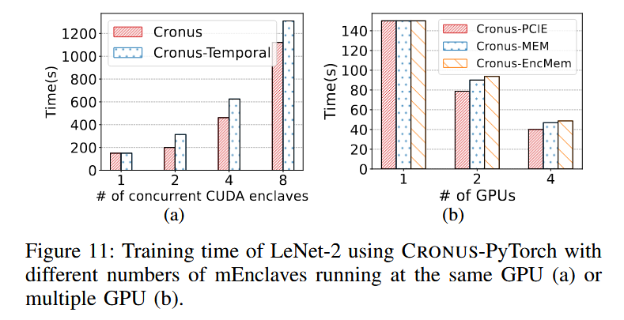

## (MICRO 2022) CRONUS: Fault-isolated, Secure and High-performance Heterogeneous Computing for Trusted Execution Environment

DOI: 10.1109/MICRO56248.2022.00019

Three Research Questions for the ideal design for TEE for heterogeneous computing:

1. Supports general **heterogeneous** accelerators.
2. Enables **spatial sharing** on one accelerator.
3. Enforces strong **isolation** across accelerators.

The motivation stems from practical cloud computing needs - **accelerator-equipped servers have 10x higher failure rates** than CPU-only servers, yet typical accelerator **utilization is extremely low** (around 10%).

The key design of CRONUS:

1. Partition heterogeneous computation into isolated TEE enclaves, where **each enclave encapsulates only one kind of computation** (e.g., GPU computation), and multiple enclaves can **spatially share** an accelerator.
   - Specifically, partition a monolithic enclave running heterogeneous computing tasks on different hardware (e.g., CPU-GPU coordinated DNN training) into several micro enclaves (mEnclaves) and partitions the monolithic OS into several micro OSes (mOSes). **Each mOS is a shim trusted runtime that manages only one accelerator**.
2. Constructs heterogeneous computing using remote procedure calls (RPCs) among enclaves. To avoid prohibitive performance degradation from frequent context switches by RPC calls, they propose a streaming RPC (sRPC) such that RPC is done over shared trusted TEE memory. This design also resists reorder and replay attacks.
3. Isolates different mOSes (and its managing accelerator) by leveraging existing hardware isolation techniques (e.g., ARM S-EL2). A heterogeneous computing task trusts only the hardware (e.g., CPU and GPU) and mOSes being used, and fault leads only to the specific hardware to be restarted.
   - There is no core OS kernel in TCB like microkernels. The coordination of multiple mOSes is done outside TEE. Otherwise a fault in the core kernel that coordinates different kernel components still cause failures of the whole OS.

Results:

- Only up to 7.1% extra computation time for diverse workloads on CPU, GPU and NPU.
- Spatial sharing leads to 63.4 higher throughput.
- Fault isolation and security isolation.

### Methods

It seems that spatial sharing and strong isolation are at odds, but CRONUS solves this with a two-level management:

1. It firstly enforces inter-accelerator isolation by separating and isolating each accelerator’s managing logic into mOS using strong isolation techniques (e.g., ARM S-EL2) without knowing the accelerator details.
2. It then enforces intra-accelerator isolation at each mOS aware of the accelerator details, without hardware customization.

CRONUS is built on ARM TrustZone design. Its secure world has multiple partitions, and each partition runs as a strongly isolated ARM S-EL2 partition managed by the Secure Partition Manager. Each partition runs a MicroOS image provided by the normal world’s OS and runs multiple MicroEnclaves on top of a device (CPU or accelerators).

(Normal World) Enclave Dispatcher:

- Determines **which partition** is used to handle an mEnclave request from an application.
- Stores device type and configurations, mOS images, and usable resources in each partition.

Secure World:

1. mEnclave: user-level application for sensitive data. It runs on a device (CPU or accelerator) which may be shared across mEnclaves in the same partition (like mEnclave C and D in partition 2).
2. mOS: runs Enclave Manager and Hardware Adaption Layer (EM & HAL). 
   1. EM loads and initializes mEnclave, manages attestation and inter-enclave RPC.
   2. HAL is responsible for configuring, accessing, attesting and virtualizing hardware resources (e.g., GPU Memory) for different mEnclaves. It utilizes existing intra-accelerator isolation techniques (e.g., NVIDIA’s MPS).
      - Inludes a shim core library that implements basic kernel functions (e.g., memory mapping and locks). Can integrate off-the-shelf device drivers in Linux to support general accelerators.

#### MicroEnclave (mEnclave)

Each of them encapsulates one type of computation (e.g., CPU, GPU, or NPU computation):

- Runs at EL0 (user level) within a partition. Identified by 32-bit ID: 8 bits for mOS, 24 bits for enclave within mOS.

- Contains static list of callable mECalls and supports different execution models (dynamic libraries, CUDA ELF, etc.). Related information is provided by a `manifest` file like this:

  

**Enclave Manager** provide **device-independent** mEnclave management within each mOS such as:

- Loading and initializing mEnclaves from manifest files
- Resource allocation and bookkeeping
- Attestation coordination
- Ownership verification using Diffie-Hellman key exchange
- Inter-enclave RPC management

#### Hardware Adaptation Layer (HAL)

Overall, HAL works as a “driver” and virtualization layer for a device. It provide unified interface for hardware access and virtualization via a two-layer design:

1. **Generic HAL APIs**: Standard operations (map, configure, attest)
2. **Device-specific drivers**: Actual hardware interaction code

Most open-sourced device drivers in a monolithic OS are mature and modular (.ko format in Linux). Hence, CRONUS includes a shim runtime for running off-the-shelf device drivers in mOSes. It also includes the PCIe device driver as many heterogeneous devices are connected through PCIe.

**Spatial sharing implementation**: Uses accelerator-specific techniques (NVIDIA MPS, MIG) to share hardware among mEnclaves within the same partition.

#### Inter-accelerator Isolation (sRPC)

**Inter-mOS sharing** is necessary because a single, complete application often requires **heterogeneous computing**—meaning it uses multiple types of hardware (e.g., a CPU and a GPU) working together to complete a task. CRONUS splits a monolithic application into multiple, smaller **micro-enclaves (mEnclaves)**. Each mEnclave handles a specific type of computation and runs in the partition corresponding to the hardware it needs. For the application to function, these separate mEnclaves must communicate with each other. This is done using Remote Procedure Calls (RPCs). For example, the CPU mEnclave needs to send data and commands to the CUDA mEnclave.

There are two types of approach to prevent RPCs to be manipulated by malicious OS attackers:

1. Synchronous, such as via encryption for RPC requests that naturally resist reordering, dropping or replaying, like SSL. This lock-step RPC execution brings substantial ccost and is unsuitable for frequent or asynchronous inter-enclave RPCs.
2. Asynchronous, such as utlizing monotonic counters and merkel trees to keep globally consistent application states. But this, according to the authors, cost deployment efforts for developers.

**Asynchronous Streaming Model**: sRPC treats RPC requests as a stream, where a calling mEnclave can continuously send requests to a target mEnclave without waiting for each one to complete. The calling enclave only synchronizes when it requires a return result, which avoids the significant performance overhead caused by frequent context switches in synchronous models.

**Trusted Shared Memory**: To ensure security, sRPCs are transmitted through secure TEE memory shared between the communicating mEnclaves. This prevents the untrusted OS or other malicious actors from reordering, replaying, dropping, or manipulating the content of the RPCs.

**Mechanism**:

- When a connection is established, the enclaves perform local attestation to verify each other's identity.
- A stream is created with a ring buffer in the shared memory for storing RPC requests, along with a request index and a progress index to manage the stream.
- The calling mEnclave writes serialized requests to the buffer, while a dedicated thread in the receiving mEnclave continuously reads and executes them sequentially.

**Secure Failure Recovery**: sRPC includes a "proceed-trap" failover protocol to handle mEnclave or Micro-OS (mOS) failures securely and quickly

- When a partition fails, CRONUS immediately invalidates the stage-2 page table entries for any memory shared with that partition.
- This action prevents Time-of-check-time-of-use (TOCTOU) attacks and deadlocks by causing any subsequent access to the shared memory to generate a fault (a "trap").
- The calling mEnclave receives a fault signal, allowing it to handle the failure without leaking data or getting stuck. This ensures crash safety without requiring a full system reboot.

### Evaluation

#### R1: Performance on General Accelerators

- **Low Overhead**: Across diverse workloads on CPUs, GPUs, and NPUs, CRONUS incurs less than 7.1% extra computation time compared to unprotected native executions.
- **Microbenchmarks**:
  - On the Rodinia GPU benchmark, CRONUS showed less than 7.1% overhead compared to native execution without a TEE. It was also faster than HIX-TrustZone due to its more efficient sRPC protocol.
  - On the vta-bench NPU benchmark, the performance overhead of CRONUS was negligible, at less than 2%.
- **DNN Workloads**:
  - For DNN training using PyTorch (CRONUS-PyTorch), the overhead was less than 0.8%.
  - For DNN inference using TVM on an NPU simulator (CRONUS-TVM), the performance was nearly the same as the monolithic TrustZone and only slightly slower than native execution.

#### R2: Spatial Sharing of Accelerators

- To test the benefits of sharing a single accelerator among multiple enclaves, they ran multiple DNN training instances concurrently on one GPU.
- This spatial sharing resulted in up to a 63.4% higher throughput compared to running the tasks serially, as shown in Figure 11a. With spatial resource sharing enabled, the training time increases slowly because of resource contentions.

- Figure 11b shows the training time of LeNet-2 with various numbers of GPU running the data-parallel distributed computations. The results suggest GPU sharing using the PCIe bus results in the best performance, compared to using secure memory or encrypted memory

#### R3: Strong Isolation

- **R3.1 (Fault Isolation)**:

  - The evaluation demonstrated that CRONUS can recover from an accelerator failure by restarting only the specific mOS for that accelerator, a process that takes hundreds of milliseconds.
  - This is a significant improvement over a full system reboot, which takes minutes and affects all running tasks. When a crash was induced in one of two concurrent tasks, the unaffected task continued running without interruption.

- **R3.2 (Security Isolation)**:

  - The architecture ensures that an application only needs to trust the code of its own mEnclaves and the mOSes that manage them.
  - It does not need to trust other applications' mEnclaves or mOSes running on the same server, which greatly reduces the trusted computing base (TCB) and attack surface.

  