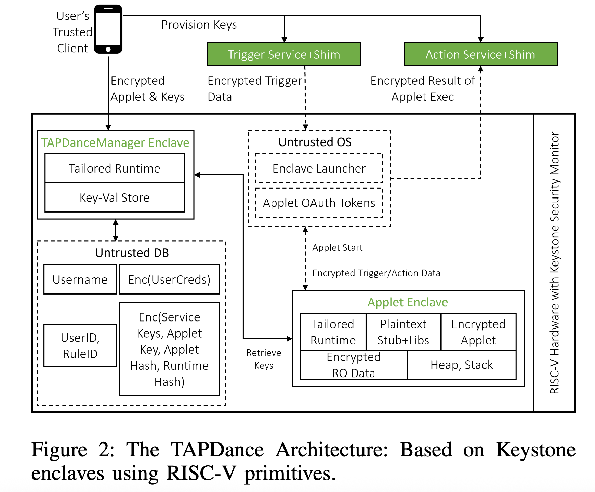

## (NDSS 2024) Architecting Trigger-Action Platforms for Security, Performance and Functionality

The paper presents **TAPDance**, which redesigns **Trigger-Action Platforms (TAPs)** to protect user privacy through several key architectural changes. They model TAP applets as **pure computations** - functions that receive trigger data, transform it, and produce action data without side effects or I/O operations. This enables running only the essential computation inside trusted execution environments while keeping everything else outside.

Motivation: Current trigger-action platforms like IFTTT and Zapier allow users to create automated workflows between web services, but they require users to place complete trust in the cloud provider. Users must trust that:

- TAPs only access necessary data
- User programs (applets) execute without tampering
- Access tokens remain secure from breaches

> [!NOTE]
>
> Is TAP a kind of serverless function?
>
> Authors: TAP applets are fundamentally different from general serverless functions and *simpler*. They're:
>
> - Extremely simple (average <100 lines)
> - Pure functions with no I/O
> - Run infrequently but need low latency
> - Have predictable, minimal resource needs
>
> In this sense, SEV might be wastefully over-engineered for such workloads. It's more suitable for applications requiring full OS services (networking, file I/O, databases).

### Key Designs

The system uses RISC-V Keystone enclaves with several key components:

- Applet Enclaves: Run **compiled user code** (not interpreted TypeScript) in isolated memory
- TAPDanceManager Enclave: **Long-running enclave** that verifies other enclaves and manages keys
- Security Monitor: Extended to provide secure time, randomness, and nonce management
- Trusted Client: User's device that compiles applets and manages credentials

**Protocol Flow**: When triggered, the system fetches encrypted data, launches an applet enclave, verifies its attestation, provides decryption keys, executes the applet, and sends encrypted results to the action service.

**Minimal Trust Model**

- Users only trust their client device and the processor's hardware root-of-trust. The entire TAP cloud service is considered untrustworthy
- Client devices handle OAuth token negotiation and applet compilation
- TAPDanceManager enclave provides attestation verification when users are offline

**Compilation Instead of Interpretation**

- Compiles TypeScript applets to machine code instead of using interpreters. This significantly reduces the trusted computing base (5.2x smaller than Node.js approach)
- Supports a restricted but practical subset of TypeScript (642/682 real applets)

**Freshness and Replay Protection**

- Centralized nonce management in the security monitor prevents replay attacks
- Timestamps ensure applets only execute on fresh trigger data
- Each applet execution is tied to a unique, verified nonce

### Evaluations

Evaluated on StarFive VisionFive RISC-V board:

- 32% lower latency than interpreted baseline
- 33% higher throughput than baseline
- 5.2x reduction in trusted computing base (213K vs 1044K lines of code)
- 2.1 MB memory per applet enclave vs 39 MB for Node.js baseline

TAPDance achieves better trade-offs than previous secure TAP systems:

- Better performance than eTAP/Walnut (which use expensive garbled circuits)
- Stronger security than minTAP/DTAP/oTAP (which leak some data to untrusted TAP)
- Supports more functionality than circuit-based approaches

### Discussions

**Q: Why not other TEEs like SEV?**

Authors: 

1. **No small contiguous isolated memory segments without paging**: SEV relies on page-based memory protection and encryption, while TAPDance needs simple contiguous memory regions for small applets
2. **Large hardware TCB**: SEV requires complex memory encryption hardware and page management mechanisms
3. **No secure hardware time source**: Critical for their freshness guarantees
4. **No monitor support for freshness**: They need customizable security monitor capabilities like nonce management. This is indeed hard to achieve in SEV or SGX.
5. **Threat model? 🤔** The authors argue that SEV is designed for a stronger threat model (protecting against physical attackers who can inspect DRAM) than they need. They only consider remote attackers, so the mandatory memory encryption in SEV is an overkill.

My thoughts:

- RISC-V servers are not popular or strong by its own, so their solution has poor practical deployability. Their evaluation on a Raspberry Pi-equivalent board doesn't reflect real deployment scenarios.
- Their remote-only threat model may be overly restrictive. Cloud environments could face:
  - Insider attacks from malicious employees
  - Supply chain attacks on hardware
  - Physical side-channel attacks
- Memory encryption overhead: is this a real concern, considering the trigger is infrequent by its own?
- Scalability in the Keystone design: PMP registers are limited in number (typically 8-16), which could constrain scalability for large-scale deployment. In this sense, SEV's page-based approach scales better for larger numbers of concurrent enclaves.
- Maintenance: Custom compiler toolchain maintenance, Limited hardware vendor options, etc. With SEV, no custom toolchain and deployment solution is needed.

