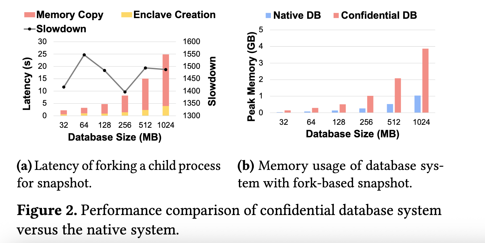
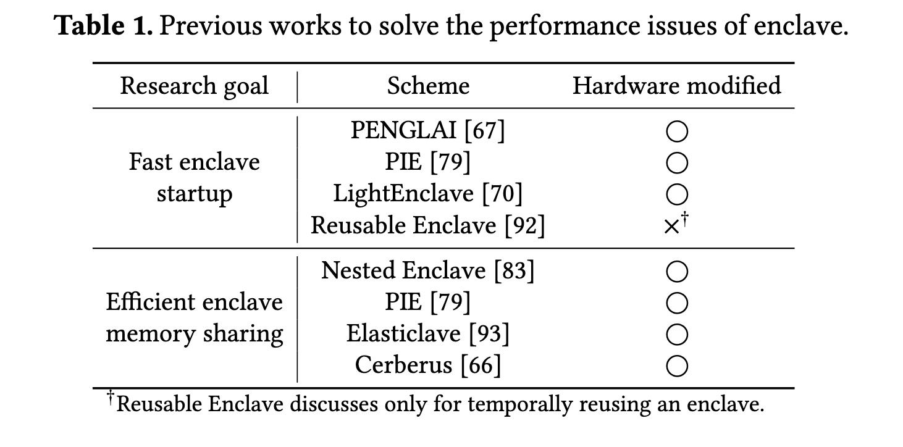
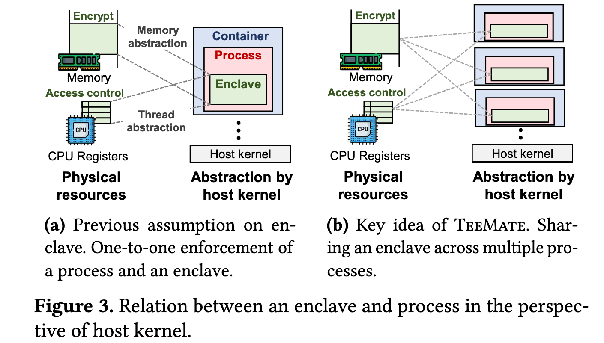
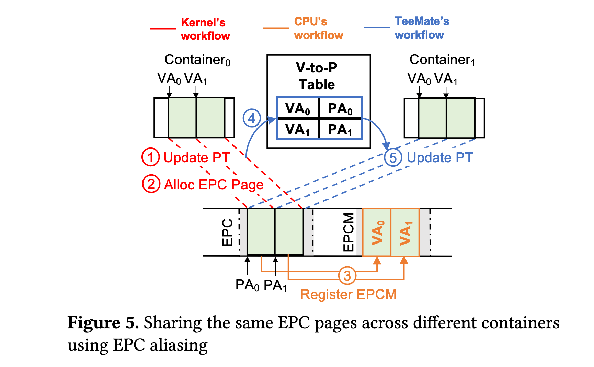
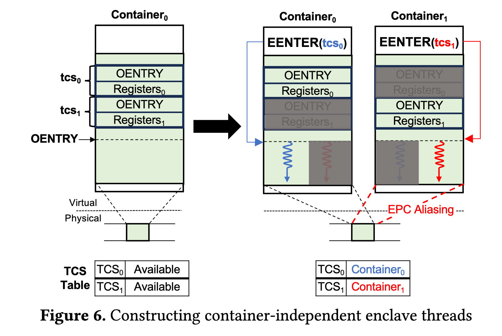

## TeeMate: Fast and Efficient Confidential Container using Shared Enclave

This paper addresses performance issues in confidential containers - systems that combine containerization with TEE to provide both resource management and data protection. Current confidential containers suffer from significant overheads due to creating dedicated enclaves for each container, resulting in high startup latency and memory usage.

This is specially problematic for various serverless computing as well as databases. For fork-based snapshots, the parent database process continues to handle the requests by forking a child process, while the child process performs the snapshot by writing the database into the storage. With current confidential containers, fork-based snapshot for database would create a new (child) process and enclave, copy the parent enclave’s memory into the child’s enclave and run as usual—i.e., the parent serving the requests while the child performing the snapshot. However, copy-on-write semantics would not be allowed as the parent’s enclave and the child’s enclave cannot share the same protected memory. Current confidential containers **assign an enclave for each container**, which naturally follows the concept of the container and the enclave. They note that **inability to share the memory between parent and child enclave is the main cause of these overheads**. 

The authors challenge a "universal misconception" that enclaves must be bound to single processes. They demonstrate that enclaves are merely protected physical resources that **can be shared across multiple processes** while maintaining security guarantees.

Most of the works cannot be directly applied to current cloud platforms because they require hardware modifications. In contrast, they show that TEEMate approach works without hardware modifications.

### Methodology

Key idea: **Sharing a Single Enclave across Multiple Containers**

TeeMate enables multiple containers to share a single enclave by:

1. **EPC Aliasing**: Maps the same enclave memory pages to different virtual address spaces across processes. They identified that SGX's EPCM (Enclave Page Cache Metadata) validation doesn't include process identifiers, which enables cross-process enclave sharing
2. **Thread Assignment**: Assigns individual enclave threads to different containers using Thread Control Structures (TCS)
3. **Intra-enclave Isolation**: Uses software-based isolation (V8 Isolate for serverless, software address translation for databases) to separate processes within the shared **enclave**
4. This is potentially applicable to other TEEs like AMD SEV-SNP

#### Design Objective 1: Preserve Memory Abstraction

**Challenge**: Multiple processes need to access the same physical enclave memory while maintaining their separate virtual address spaces.

**Solution: EPC Aliasing**

In Intel SGX, protected memory pages are called Enclave Page Cache (EPC) pages. The hardware validates memory access through the EPCM (EPC Metadata), which stores the virtual address that should map to each physical page. The crucial insight is that EPCM doesn't store process identifiers - it only cares about the virtual-to-physical address mapping.

When Container0 creates an enclave, TeeMate records the address mappings (like VA0 → PA0). When Container1 wants to share this enclave, **TeeMate updates Container1's page table with the same mappings**. Now both containers can access the same physical memory using identical virtual addresses, but from their separate address spaces.

#### Design Objective 2: Preserve Thread Abstraction

**Challenge**: We would like to make it appear to the host kernel that each containerized process has its own dedicated enclave thread, when in reality multiple processes are *sharing threads* from the same enclave.

**Solution: TCS Pool Management**

(Fig. 6: a single container and an enclave were initially created, all two pages are available in the enclave before any enclave code is run; later, a new container is created, which shares the EPC pages through EPC aliasing. When a container calls `EENTER(tcs₀)`, that TCS becomes occupied until the enclave thread exits or is interrupted.)

TeeMate **assigns the threads in the same enclave to each different process** so that the host kernel can run each enclave thread in different containerized environments—e.g., providing different file systems using **namespace**. Imagine a shared workspace with multiple desks (Thread Control Structures). Each desk has its own workspace setup and can be used by any worker, but **only one worker can use each desk at a time**.

SGX manages enclave threads through TCS pages, which contain:

- **Entry point** (OENTRY field): The code address where the enclave thread starts or resumes. The entry point often contains security checks and enforcement to sanitize the inputs from nonenclave context.
- **CPU register context**: Saved/restored when the thread exits/resumes execution (references to state save area, or SSA, in the EPC pages)

Initial TCS pages are measured as other EPC pages, thereby preventing untrusted system components from breaking its initial integrity. TeeMate maintains a TCS table that tracks which TCS pages are available. When a container needs to execute enclave code:

1. TeeMate assigns an available TCS page to that container
2. The container enters the enclave using that specific TCS
3. When execution completes, the TCS returns to the available pool

The key insight is that SGX **doesn't enforce which process can use which TCS.** Any process can enter the enclave with any TCS as long as the address mapping is valid. This allows dynamic thread assignment while **maintaining the illusion of dedicated threads per process**.

##### Thoughts?

I am wondering 🤔:

- Does the enclave check which container is calling?

- Yes, (but partially?): in the paper, "enabled it (Gramine LibOS) to identify the process (based on a requested TCS page) such that the integrity of the files (outside the enclave) can be checked per process." Intuitively, we also need to make sure the calling party is legitimate somehow.

  - But based on a requested TCS page? There's no secure way to bind a container's identity to a TCS page because the TCS assignment is managed by TeeMate's controller running in the untrusted host 

    - They argue that the integrity of TeeMate controller doesn't concern the security of the system.

      > This is the same question as “what if the compromised host modifies all the states of a process (except the memory of the enclave) to be the other one, and enters the enclave?”. The second question is already the common threat model of confidential computing, and widely discussed in the academia [2, 8, 16, 33]. The answer is that “the host cannot compromise the enclave as all the security critical data and logic should be located in the enclave”—i.e., the security guarantees of the confidential computing (and those of TeeMate) still hold.

    - *Their explanation does not solve the security concern sufficiently and is very handwavy!* Since the host kernel controls which container gets which TCS, a malicious host could potentially:

      - Assign Container₁ to use Container₀'s TCS
      - Swap TCS assignments between containers
      - Make one container impersonate another
      - Using TCS page as the sole identifier means the enclave is essentially saying: "whoever uses TCS₀ must be Container₀" - but there's no verification that the right container is actually using it.
      - This **breaks isolation between containers**.
    - What could be done? E.g. Cryptographic container identification - Each container proves its identity to the enclave

- Other details not disclosed: whether each container performs separate attestation or shares a common attestation; How exactly the enclave verifies container identity beyond TCS-based identification; How encryption keys and secrets are managed per container within the shared enclave, etc... Trading security for performance doesn't usually lead to a good idea in security paper.

#### Design Objective 3: Maintain Security Isolation

**Challenge**: If multiple processes share the same enclave, how do we prevent them from interfering with each other's data and execution?

**Solution: Intra-Enclave Isolation**

Since we can't rely on hardware isolation between separate enclaves, TeeMate implements **software-based isolation within the shared enclave**. The specific mechanism depends on the application:

For serverless computing, TeeMate uses V8 Isolate, which creates sandboxed execution environments within the same JavaScript runtime. Each function runs in its own isolate, preventing access to other functions' memory and data.

For database applications, TeeMate implements software address translation. When a process writes to memory, the system checks if that page needs to be copied (copy-on-write semantics), ensuring that different processes see consistent but isolated views of the data.

### Evaluation

> Implementation:
>
> We implemented *TeeMate controller* with 490 LoC in Linux SGX driver, 10 LoC in Linux kernel, and 250 LoC in Gramine LibOS. This is for EPC aliasing and book-keeping which process uses which TCS page.
>
> We implemented 1800 LoC of Gramine LibOS (enabled it to identify the process, based on a requested TCS page, such that the integrity of the files (outside the enclave) can be checked per process.) for *TeeMate runtime*, 170 LoC in Node.js for confidential serverless computing, and 270 LoC in Redis for confidential database.

The authors implemented TeeMate on Intel SGX and tested it on two applications:

**Confidential Serverless Computing** (Node.js):

- 4.54-6.98× latency speedup
- 2.8-5× memory usage reduction
- Comparable throughput to native applications

**Confidential Database** (Redis):

- 277.6-1046.6× latency speedup for fork operations
- 41% memory usage reduction
- Maintains copy-on-write semantics

**Generally,** this feature (data sharing between multiple processes) can be widely applied to the confidential computing use-cases that need **frequent data communications**, while the resources are managed by untrusted host kernel (e.g., micro-service architecture using Kubernetes, or big data analysis using Spark).

### Discussions

**Applicability to SEV-SNP?**

1. ASID-Based Access Control

- Each VM has an **Address Space Identifier (ASID)** that selects a VM Encryption Key (VEK). The VEK encrypts/decrypts the VM's memory pages
- **Critically**: The hypervisor can modify ASID at runtime during VMEXIT events

2. Reverse Map Table Validation

- SEV-SNP maintains a reverse map table recording each VM's ASID and guest physical addresses. When a VM accesses memory, *hardware validates the ASID and guest physical address match the recorded values*
- This prevents page remapping attacks (similar to SGX's EPCM)

> To share the same enclave pages (i.e., secure pages of the same VM) between multiple processes, **the hypervisor should** first record the ASID of the VM which allocates the pages. Then, when another process attempts to access the page, the hypervisor should assign the ASID of the VM that originally allocated the page. Furthermore, the **hypervisor needs** to assign the same nested page table to ensure that the enclave page is accessed using the same guest physical address.
>

To share the same secure pages between multiple processes:

1. Hypervisor records the ASID of the VM that allocated the pages
2. When another process wants access, hypervisor **assigns the original VM's ASID**
3. Hypervisor assigns the **same nested page table** to ensure identical guest physical addresses

They claim to have implemented this by modifying Linux KVM to change ASID and nested page table pointer (nCR3) during VMEXIT events. But still, the paper **doesn't explain how processes within the shared VM establish their identities or prevent impersonation.** Now you must trust, additionally:

- The hypervisor's ASID management
- The nested page table assignments

The system relies on untrusted components (hypervisor) to correctly manage security-critical resource assignments, which expands TCB beyond the scope of the original assumption made by SEV-SNP.